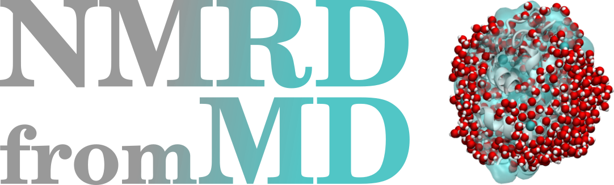

# NMRDfromMD

Dipolar Nuclear Magnetic Resonance from Molecular Dynamics (NMRDfromMD) is a
Python toolkit designed for the computation of dipolar NMR relaxation times
(the so-called $T_1$ and $T_2$) from molecular dynamics simulations.

Used in combination with [MDAnalysis](https://www.mdanalysis.org/),
NMRDfromMD allows for the analysis of trajectory files from any
MDAnalysis-compatible simulation package, including
[LAMMPS](https://www.lammps.org/) and [GROMACS](https://www.gromacs.org/).

## Documentation

Details about installation and use of NMRDfromMD are given in the
[documentation](https://nmrdfrommd.github.io). The documentation also
includes a description of the theory behind dipolar NMR calculations, as well
as details on some common pitfalls of NMR analysis.

    
    
    

Figure: Examples of systems that can be analyzed using NMRDfromMD, from left to
right: a bulk water system, a Lennard-Jones fluid, and a lysozyme in water.

## Datasets

Two molecular dynamics datasets are available on GitHub. One is a
[polymer in water](https://github.com/simongravelle/polymer-in-water.git)
system generated using LAMMPS. The second is a
[water confined in silica](https://github.com/simongravelle/water-in-silica.git)
system generated using GROMACS. Both datasets are required to follow the
tutorials provided in the
[documentation](https://nmrformd.readthedocs.io/en/latest/).

## Warning

The code has mostly been tested in the case of ¹H-NMR (i.e., spin 1/2).  
It is also important to keep in mind that NMRDfromMD only works for dipolar
interactions, not quadrupolar interactions.

## Known issues

For very large trajectory files, the code requires a lot of memory.  
The code is not adapted to triclinic boxes — convert your trajectory to
orthorhombic before running calculations. This code is still in development,
so please raise an issue [here](https://github.com/NMRDfromMD/NMRDfromMD.github.io/issues)
if you encounter a problem.

## For developers

If you intend to make modifications to the code, please raise an issue or send
me an email first. Then, fork the repository, apply your changes, and make a
pull request that will be reviewed. Find more instructions
[here](developers/README.md).

## Acknowledgments

This project has received funding from the European Union's Horizon 2020
research and innovation programme under the Marie Skłodowska-Curie grant
agreement No 101065060.
