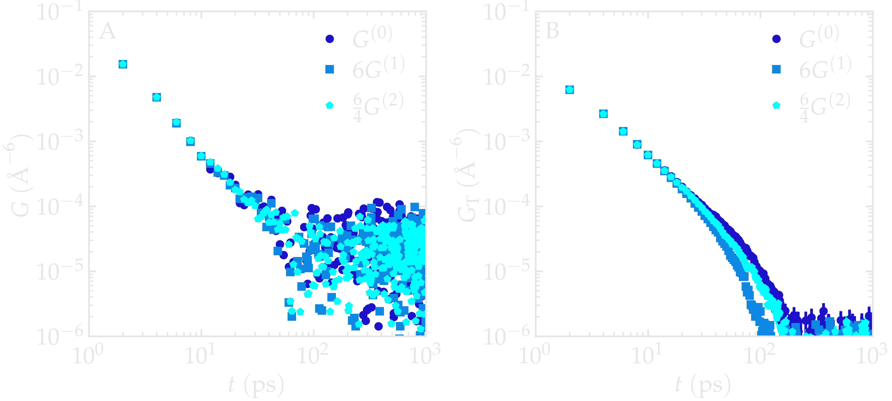
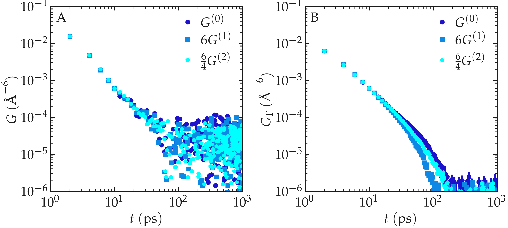

.. _isotropic-consistency:

Isotropic consistency of :math:`G^{(m)}`
========================================

Here, we verify one of the central assumptions used when measuring NMR relaxation properties
of isotropic bulk liquids, for which no direction in space is preferred. For such
isotropic systems, the three second-rank dipolar correlation functions are
expected to satisfy :cite:`hubbardTheoryNuclearMagnetic1963`

.. math::

    G^{(0)} = 6 G^{(1)} = \frac{6}{4} G^{(2)}.

The three correlation functions :math:`G^{(m)}` differ only by their
spherical harmonic order :math:`m = 0, 1, 2`. Because all orientations
are equally probable, the orientation average cannot depend on
:math:`m`, and the functions :math:`G^{(m)}` are therefore proportional
to one another. A similar benchmark was done,
for instance, in Ref. :cite:`becherMolecularDynamicsSimulations2021`
with glycerol.

The numerical prefactors :math:`1, 6, 6/4` arise solely from the
explicit forms of the rank-2 spherical harmonics :math:`Y_2^m`, whose
squared moduli satisfy
:math:`|Y_2^0|^2 : |Y_2^1|^2 : |Y_2^2|^2 = 1 : 3 : 3`,
combined with the symmetry factor accounting for :math:`m > 0` pairs.

Our results obtained from a bulk water system show that the
proportionality relation is well verified. Small deviations become
visible at times longer than approximately 20 ps in the intermolecular
correlation functions and are likely due to statistical fluctuations.

          analysed using NMRDfromMD

          analysed using NMRDfromMD

.. container:: figurelegend

    Figure: A) Comparison between :math:`G^{(0)}`, :math:`6 G^{(1)}`
    and :math:`\frac{6}{4} G^{(2)}` obtained from a bulk water
    molecular dynamics simulation. B) Comparison between the
    intermolecular correlation functions
    :math:`G_\mathrm{T}^{(0)}`, :math:`6 G_\mathrm{T}^{(1)}`
    and :math:`\frac{6}{4} G_\mathrm{T}^{(2)}`.
