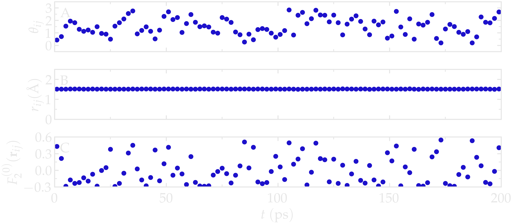
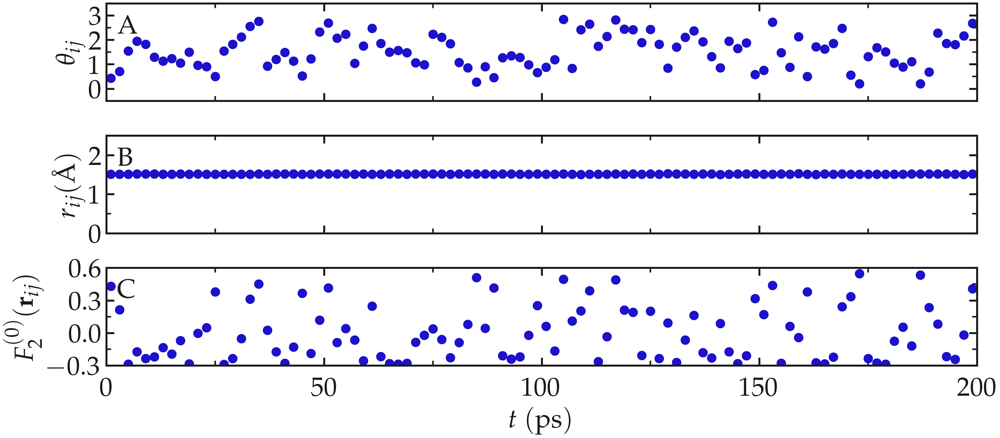
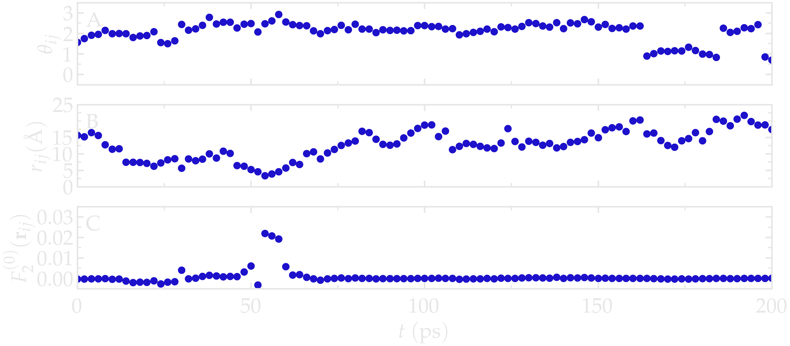
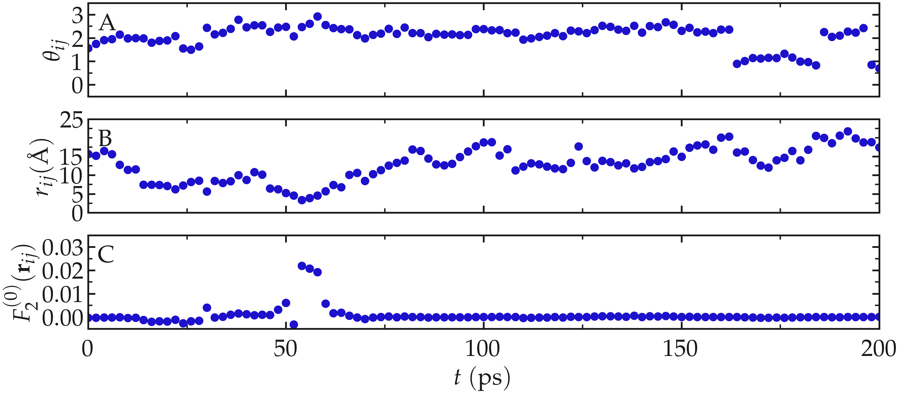

.. _pair-dynamics:

Microscopic origin of relaxation
================================

To understand the origin of the relaxation spectra, it is useful to
return to the atomic trajectories themselves. The dipolar interaction
between two nuclear spins depends on both their separation
:math:`r_{ij}` and their relative orientation
:math:`\Omega_{ij}`. Following the evolution of these quantities in
time therefore provides direct insight into the microscopic origin of
NMR relaxation.

As a illustration, we consired a bulk water system.
Given that this system is isotropic, the correlation functions satisfy
:math:`G^{(0)} = 6 G^{(1)} = 6/4 G^{(2)}`.
It is therefore sufficient to compute only :math:`G^{(0)}` and the
corresponding spectral density :math:`J^{(0)}`. In this case, the
angular dependence reduces to the polar angle :math:`\theta_{ij}`,
since :math:`Y_2^{(0)}` is independent of the azimuthal angle
:math:`\varphi`.

Intra-molecular contribution
----------------------------

We first consider the two hydrogen atoms belonging to the same water
molecule. Because the present water model (TIP4P/:math:`\epsilon`) is
rigid, the internuclear distance :math:`r_{ij}` remains essentially
constant (within the tolerance of the SHAKE algorithm used to enforce
molecular rigidity).

The only quantity that changes with time is therefore the orientation
of the H-H vector with respect to the external magnetic field,
described by the polar angle :math:`\theta_{ij}` (see figure below).

The dipolar interaction entering the relaxation equations is described
by :math:`F_2^{(0)}` (Eq. :eq:`F_2_0`), which depends on both the
internuclear distance and its orientation.

Since :math:`r_{ij}` is nearly constant for a rigid water molecule, the
fluctuations of :math:`F_2^{(0)}` arise almost entirely from the
rotational motion of the molecule through changes in
:math:`\theta_{ij}`.

For a typical H-H distance :math:`a \approx 1.51\,\mathrm{Å}`,
:math:`F_2^{(0)}` varies between

.. math::

    \frac{3\cos^2 0 - 1}{a^3}
    \approx 0.58~\mathrm{Å}^{-3}

and

.. math::

    \frac{3\cos^2 (\pi/2) - 1}{a^3}
    \approx -0.29~\mathrm{Å}^{-3},

corresponding to the H--H vector being parallel and perpendicular to
the magnetic field, respectively.

Thus, although the internuclear distance is essentially fixed,
molecular rotation produces substantial fluctuations of the dipolar
interaction.

.. container:: figurelegend

    Figure: A) :math:`\theta_{ij}` as a function of the time
    :math:`t`, where :math:`i` and :math:`j` refer to two hydrogen
    atoms located within the same water molecule. B) :math:`r_{ij}` as
    a function of time. C) :math:`F_{2}^{(0)}` as a function of time.
    The temperature is 300 K, and the total number of water molecules
    is 2000.

Inter-molecular contribution
----------------------------

We now consider two hydrogen atoms belonging to different water
molecules. In contrast with the intramolecular case, both the
internuclear distance and the relative orientation fluctuate because
of translational diffusion.

In this case, :math:`r_{ij}` fluctuates significantly between
:math:`\approx 2.5\,\mathrm{Å}`, corresponding to molecules occupying
their respective hydration shell, to larger values (potentially as
large as the box permits).

As can be seen, the function :math:`F_2^{(0)}` reaches its largest
absolute values, here about :math:`0.02\,\mathrm{Å}^{-3}`, when
:math:`r_{ij}` is the shortest.

.. container:: figurelegend

    Figure: A) :math:`\theta_{ij}` as a function of the time
    :math:`t`, where :math:`i` and :math:`j` refer to two hydrogen
    atoms located within two different water molecules. B)
    :math:`r_{ij}` as a function of time. C) :math:`F_2^{(0)}` as a
    function of time. The temperature is 300 K, and the total number
    of water molecules is 2000.
