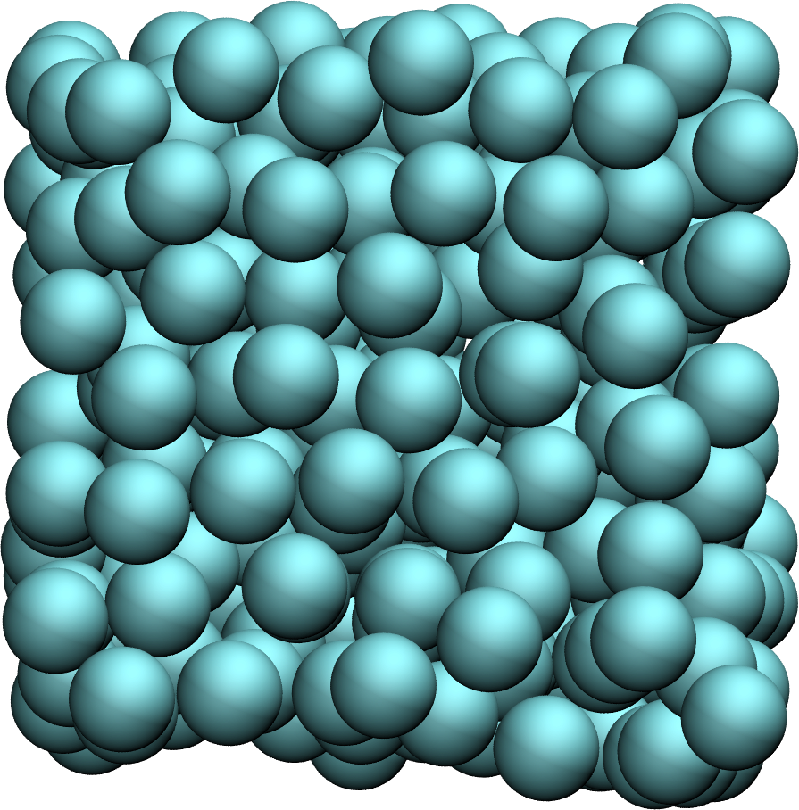
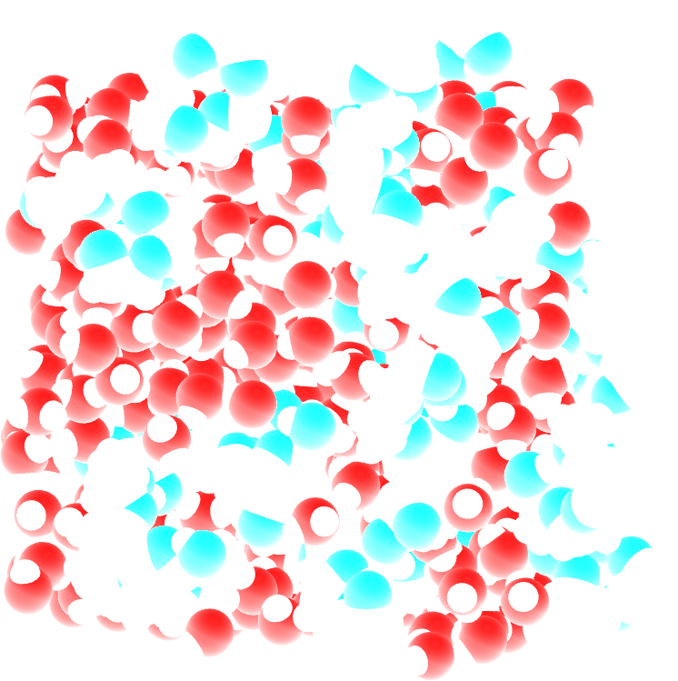
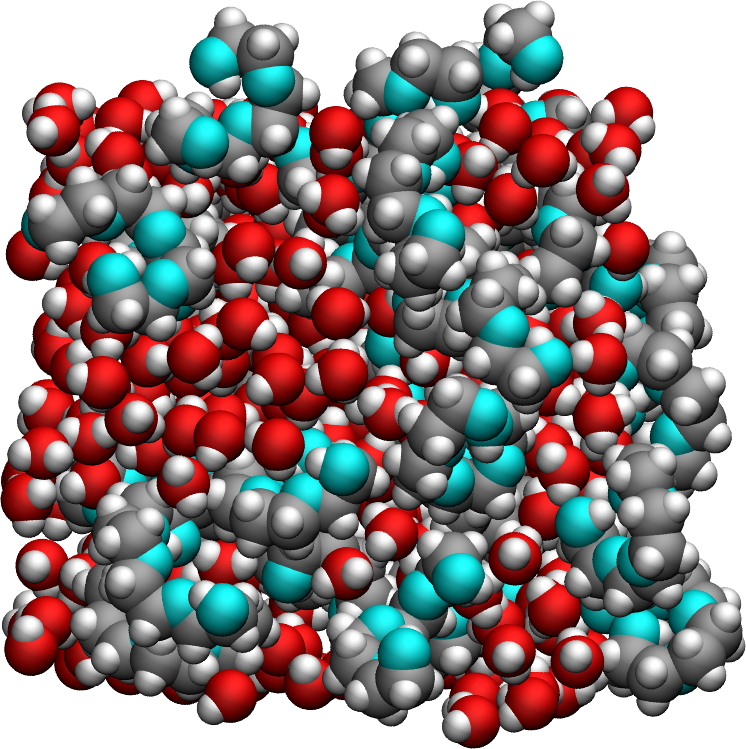
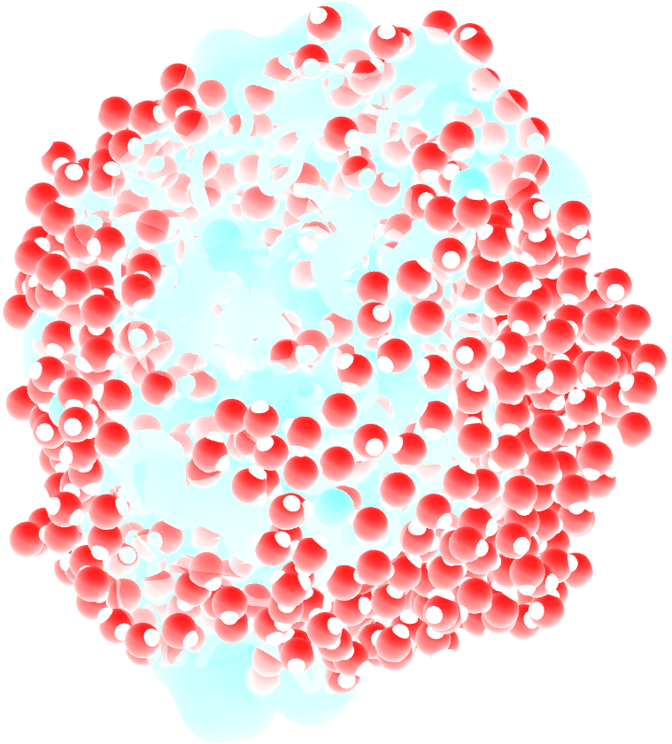
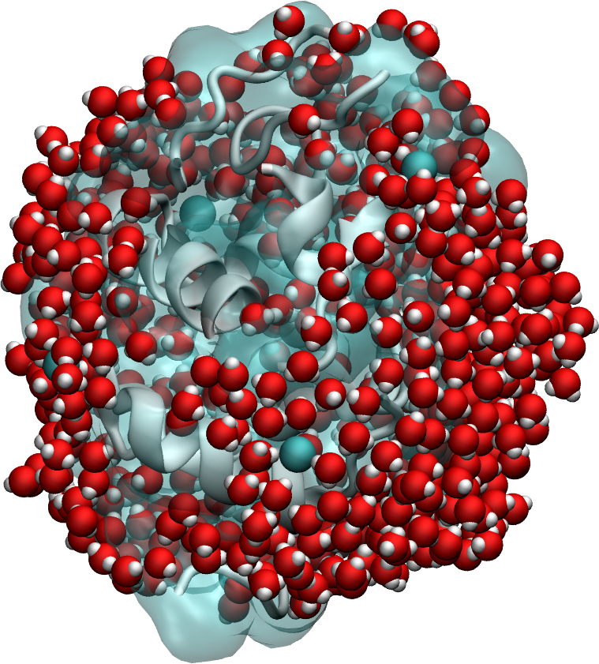
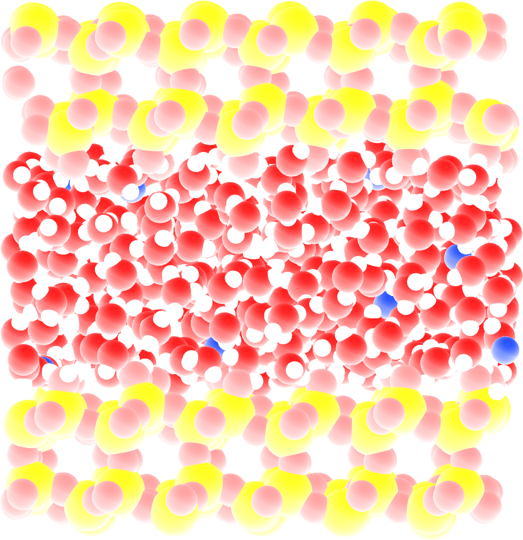
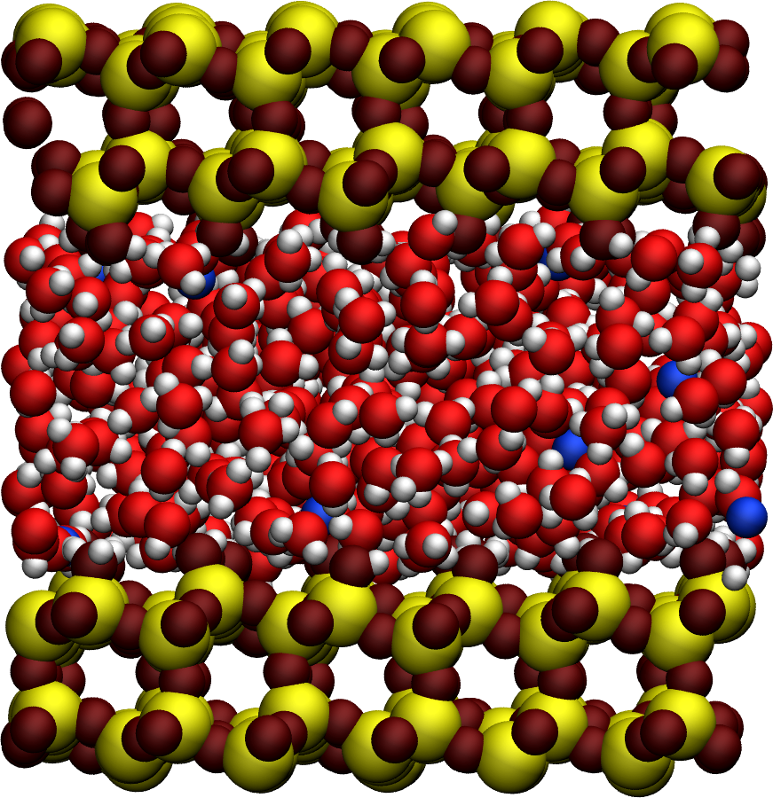

.. include:: ../additional/links.rst
.. _simulation-methods:
 
Simulation methods
===================
 
This page collects the molecular dynamics (MD) simulation details for the
systems presented throughout this documentation. Each application or
validation page links back here rather than repeating the full setup, so
that simulation parameters are documented in a single, consistent location.

.. admonition:: Note
    :class: non-title-info

    If you'd like to learn LAMMPS and generate your own trajectories, beginner
    |lammps-tutorials| are available here :cite:`gravelleSetTutorialsLAMMPS2025`.
    GROMACS |gromacs-tutorials| are also available.

Lennard-Jones fluid
--------------------

 

The simulated system contains 16,000 particles interacting through the
classical Lennard--Jones (12-6) potential and was simulated using
LAMMPS :cite:`thompsonLAMMPSFlexibleSimulation2022`. Each particle has a
mass :math:`m = 1\,\mathrm{g/mol}` together with LJ parameters
:math:`\sigma = 3\,\text{Å}` and :math:`\epsilon = 0.1\,\mathrm{kcal/mol}`.
All reduced simulation parameters were chosen to reproduce the study of
Grivet :cite:`grivetNMRRelaxationParameters2005`. In particular, the
interaction cutoff was set to :math:`4 \sigma`, while the cubic
simulation box had a side length of :math:`26.9 \sigma`, corresponding to
the reduced density :math:`\rho^*=0.84`. Production runs were performed in the
microcanonical (NVE) ensemble, during which 10,000 timesteps were executed,
equivalent to 50 times the reference time :math:`\sqrt{m \sigma^2/\epsilon}`.
Configurations were recorded every 10 timesteps. A timestep of 
:math:`0.005\,\sqrt{m \sigma^2/\epsilon}` was used.
The imposed temperatures ranged from :math:`T = 30` to 
:math:`160\,\text{K}`, corresponding to reduced temperatures from 
:math:`T^* = 0.8` to :math:`3.0`.

.. admonition:: Reduced Lennard--Jones units
    :class: non-title-info

    Lennard-Jones simulations are commonly expressed in reduced units,
    where the particle mass :math:`m`, the characteristic length
    :math:`\sigma`, and the interaction energy :math:`\epsilon` define
    the natural scales of the system. Using reduced variables allows
    simulations with different physical parameters to be compared
    directly.

Bulk water
----------

.. image:: ../figures/tutorials/bulk-water/water-dark-square.png
    :class: only-dark
    :alt: Water molecules simulated with lammps - NMR relaxation time calculation
    :width: 250
    :align: right

.. image:: ../figures/tutorials/bulk-water/water-light-square.png
    :class: only-light
    :alt: Water molecules simulated with lammps - NMR relaxation time calculation
    :width: 250
    :align: right

The system consists of a bulk liquid containing :math:`N = 4000` water
molecules. The simulation box was cubic, with equilibrium dimensions of about
:math:`(5\,\text{nm})^3`. Simulations were performed using LAMMPS. Non-bonded
Lennard-Jones interactions were truncated at a cutoff :math:`r_\text{LJ}`
distance of :math:`1.4\,\text{nm}`. The default water model used throughout
this documentation is :math:`\text{TIP4P}-2005` :cite:`abascalGeneralPurposeModel2005`.
The system was first equilibrated in the NPT ensemble at a
temperature :math:`T`, with a default value of :math:`T = 300\,\text{K}`
(values between 280 and 320 K were also considered), and a pressure of
:math:`p = 1\,\text{atm}`, using a Nose-Hoover thermostat and barostat for
temperature and pressure control. The trajectory was then recorded during a
:math:`2\,\text{ns}` production run performed in the NVT ensemble, using a
Nose-Hoover thermostat to control the temperature. A
timestep of :math:`2\,\text{fs}` was used in combination with the
SHAKE algorithm. The atomic positions were written every :math:`\Delta t = 20\,\text{fs}`.

The parameters given here are the defaults, although other values were used in the
:ref:`best-practice` section to test their effect on the NMR relaxation properties,
including different values of :math:`N` and :math:`r_\text{LJ}`, as well as
different water models.

Bulk polymer-water
------------------

The system consists of a bulk mixture containing
420 :math:`\mathrm{H_2O}` molecules and 30 :math:`\mathrm{PEG\ 300}`
polymer molecules. Water is described using the
:math:`\mathrm{TIP4P}-\epsilon` force field
:cite:`fuentes-azcatlNonPolarizableForceField2014`.
:math:`\mathrm{PEG\ 300}` denotes polyethylene glycol chains with a
molar mass of :math:`300~\mathrm{g/mol}`.

The trajectory was recorded during a
:math:`10~\text{ns}` production run performed using LAMMPS in the
:math:`NpT` ensemble with a timestep of :math:`1~\text{fs}`.
The temperature was set to :math:`T = 300~\text{K}` and the pressure to
:math:`p = 1~\text{atm}`. Atomic positions were saved every
:math:`2~\mathrm{ps}`. Non-bonded
Lennard-Jones interactions were truncated at a cutoff :math:`r_\text{LJ}`
distance of :math:`1.4\,\text{nm}

Lysozyme in water
-----------------

The system is made of a lysozyme (HEWL) with 594 water molecules, which
corresponds to water-to-protein mass ratio of :math:`73\,\%`.
The simulation was performed using GROMACS with a :math:`2\,\text{fs}`. timestep,
a :math:`100\,\text{ns}`, and trajectories recorded every 1 ps at 300 K.

Nanoconfined water
------------------

The system consists of 602 :math:`\text{TIP4P}-\epsilon` water molecules
confined within a silica slit nanopore. The trajectory was recorded during a
:math:`10\,\text{ns}` production run performed using the open-source GROMACS
software, in the anisotropic :math:`NP_zT` ensemble, with a timestep of
:math:`1\,\text{fs}`. To balance the surface charge, 20 sodium ions were added
to the slit. The system was maintained at a temperature of :math:`T = 300\,\text{K}`
and a pressure of :math:`p = 1\,\text{bar}`. Atomic positions were saved to the
every :math:`2\,\text{ps}`.