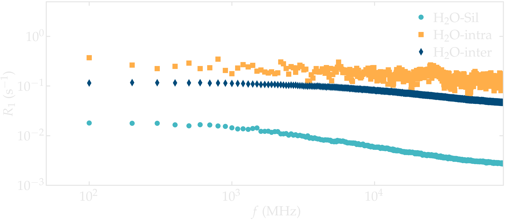
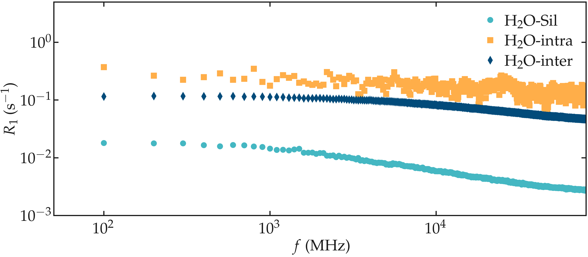

.. include:: ../additional/links.rst
.. _anisotropic-label:

Nanoconfined water
==================

In this tutorial, the H-NMR relaxation rates :math:`R_1` and :math:`R_2` are
measured for water confined within a nanoslit composed of silica. 
This system illustrates an anisotropic case, where all three correlation functions,
:math:`G^{(1)}`, :math:`G^{(2)}`, and :math:`G^{(3)}`, must be evaluated,
and the rates must be calculated from Eqs. :eq:`eq_BPP_R1` - :eq:`eq_BPP_R2`. The hydrogen
atoms of interest include those in the water molecules and those in the surface
hydroxyl (-OH) groups of the silica. The individual contributions to
:math:`R_1` and :math:`R_2`, namely, intra-molecular, inter-molecular, and
water-hydroxyl interactions, are computed separately.

Let us access the NMR relaxation rate :math:`R_1`:

.. code-block:: python

    R1_spectrum_H2O_SIL = nmr_H2O_SIL.R1
    R1_spectrum_H2O_INTRA = nmr_H2O_INTRA.R1
    R1_spectrum_H2O_INTER = nmr_H2O_INTER.R1
    f = nmr_H2O_SIL.f

.. container:: figurelegend

    Figure: NMR relaxation rates :math:`R_1` for the water confined in
    a silica slit.

Note that the :math:`\text{H}_2\text{O}-\text{silica}` contribution is much
smaller than the intra- and intermolecular contributions from the water. This
is due to the relatively small number of hydrogen atoms from the silica (92),
compared to the 1204 hydrogen atoms from the water.
