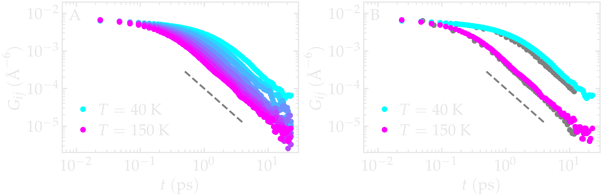
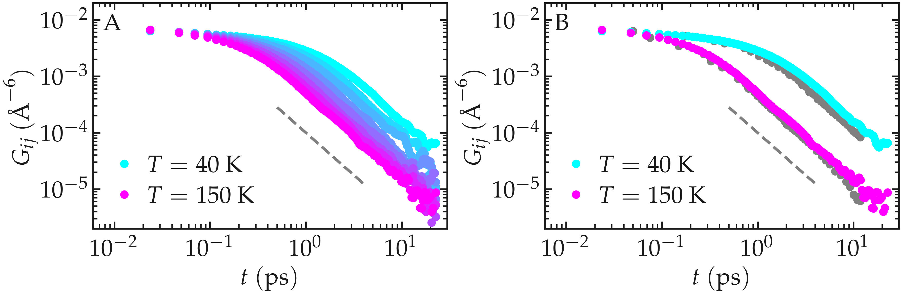
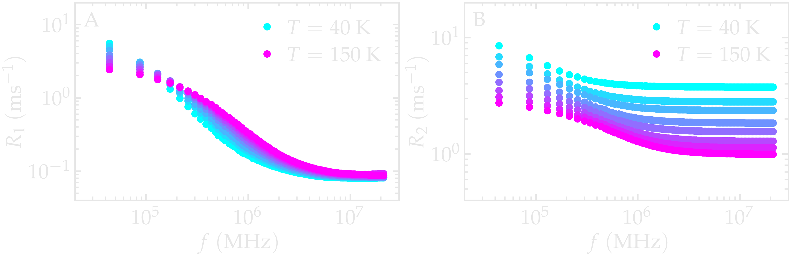
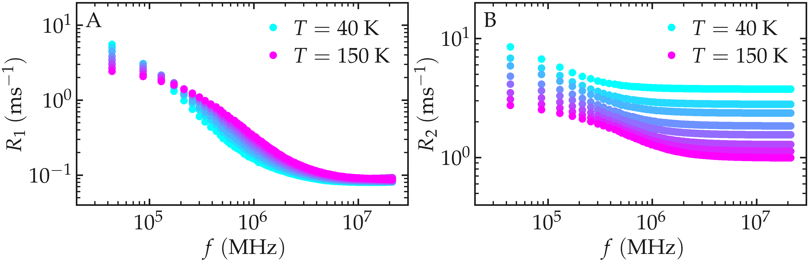
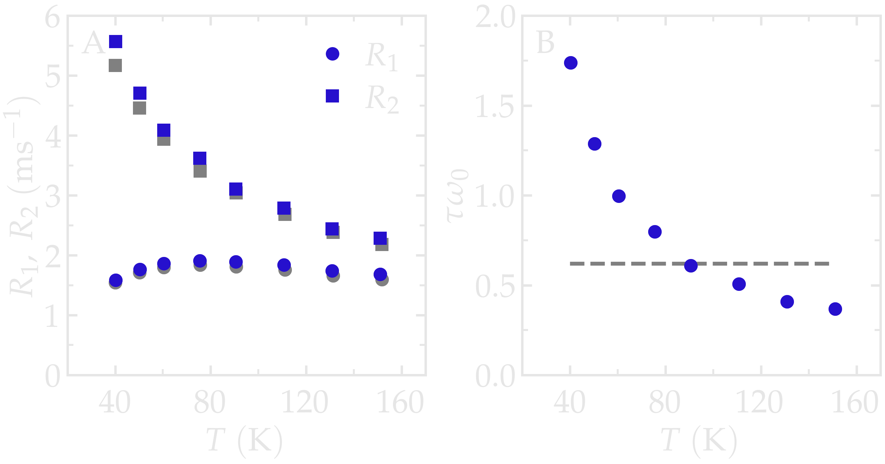
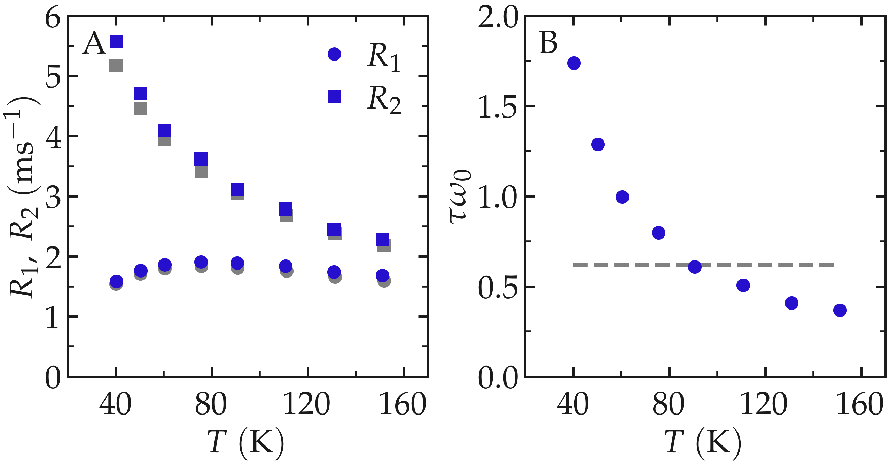

.. include:: ../additional/links.rst
.. _lennard-jones-label:

Lennard-Jones fluid
===================

This example demonstrates how ``NMRDfromMD`` reproduces the
:math:`^1\mathrm{H}`-NMR relaxation properties of a simple
Lennard--Jones fluid. Because the system consists of identical spherical
particles interacting through a single distance-dependent pair
potential, it provides an ideal benchmark for validating the
implementation against the reference calculations of Grivet
:cite:`grivetNMRRelaxationParameters2005`.

System
------

The Lennard--Jones (LJ) fluid is one of the simplest models used in
statistical mechanics. Despite its simple interaction potential, it
captures many generic properties of dense liquids which makes it a
standard benchmark in molecular simulations.

.. image:: lennard-jones-fluids/lj-dark.png
    :class: only-dark
    :alt: LJ fluid simulated with LAMMPS - Dipolar NMR relaxation time calculation
    :width: 250
    :align: right

.. image:: lennard-jones-fluids/lj-light.png
    :class: only-light
    :alt: LJ fluid simulated with LAMMPS - Dipolar NMR relaxation time calculation
    :width: 250
    :align: right

The simulated system contains 16,000 particles interacting through the
classical Lennard--Jones (12-6) potential and was simulated using
LAMMPS :cite:`thompsonLAMMPSFlexibleSimulation2022`. Each particle has a
mass :math:`m = 1\,\mathrm{g/mol}` together with LJ parameters
:math:`\sigma = 3\,\text{Å}` and
:math:`\epsilon = 0.1\,\mathrm{kcal/mol}`.

All reduced simulation parameters were chosen to reproduce the study of
Grivet :cite:`grivetNMRRelaxationParameters2005`. In particular, the
interaction cutoff was set to :math:`4 \sigma`, while the cubic
simulation box had a side length of :math:`26.9 \sigma`, corresponding to
the reduced density :math:`\rho^*=0.84`.

Production runs were performed in the microcanonical (NVE) ensemble, 
during which 10,000 timesteps were executed, equivalent to 50 times 
the reference time :math:`\sqrt{m \sigma^2/\epsilon}`. Configurations 
were recorded every 10 timesteps. A timestep of 
:math:`0.005\,\sqrt{m \sigma^2/\epsilon}` was used.
The imposed temperatures ranged from :math:`T = 30` to 
:math:`160\,\text{K}`, corresponding to reduced temperatures from 
:math:`T^* = 0.8` to :math:`3.0`.

.. admonition:: Reduced Lennard--Jones units
    :class: non-title-info

    Lennard-Jones simulations are commonly expressed in reduced units,
    where the particle mass :math:`m`, the characteristic length
    :math:`\sigma`, and the interaction energy :math:`\epsilon` define
    the natural scales of the system. Using reduced variables allows
    simulations with different physical parameters to be compared
    directly.

All LAMMPS input scripts and analysis scripts written in Python are provided
on GitHub; see |dataset-LJ-fluid|.

Benchmark for a Lennard-Jones fluid
-----------------------------------

To validate the implementation, we first compare the dipolar
autocorrelation function :math:`G_{ij}^{(0)}(t)` with the reference
results reported by Grivet :cite:`grivetNMRRelaxationParameters2005`.

For the two extreme values of :math:`T`, namely
:math:`T = 50` and :math:`140\,\text{K}`, the functions
:math:`G_{ij}^{(0)}` are compared with the correlation functions reported by
Grivet :cite:`grivetNMRRelaxationParameters2005`. Our results show good
agreement with those of Grivet, with however some differences observed at the lowest
temperature. As the temperature decreases, the correlation function decays more
slowly, indicating that molecular motion becomes less efficient at decorrelating
the dipolar interactions. Consequently, the characteristic correlation
time increases and :math:`G_{ij}^{(0)}(t)` shifts towards longer times.

The long-time :math:`t^{-3/2}` behaviour is characteristic of
hydrodynamic long-time tails in simple liquids and reflects the slow
decay of translational velocity correlations.

.. container:: figurelegend

    Figure: A) Correlation function :math:`G_{ij}^{(0)}` as extracted from the LJ
    fluid simulation for all temperatures. B) :math:`G_{ij}^{(0)}` for two
    different temperatures compared with the data from Grivet
    :cite:`grivetNMRRelaxationParameters2005` (gray symbols). The dashed
    line shows :math:`t^{-3/2}`.

For all temperatures, the NMR relaxation rate spectra  :math:`R_1(f)`
and  :math:`R_2(f)` decrease with increasing frequency :math:`f`. This behavior
reflects the frequency dependence of the spectral density function
:math:`J(\omega)`, which quantifies how much power molecular motion
contributes at a given Larmor frequency :math:`\omega = 2\pi f`. At low
frequencies, relaxation rates probe the long-time diffusive dynamics, where
:math:`J(\omega)` reaches a plateau. At frequencies larger than the inverse molecular correlation time, the
spectral density decreases because increasingly rapid magnetic-field
fluctuations become inefficient at driving nuclear-spin relaxation.
Consequently, both :math:`R_1` and :math:`R_2` decrease with increasing
frequency.

.. container:: figurelegend

    Figure: Frequency-dependent NMR relaxation rates :math:`R_1` (A) and :math:`R_2` (B)
    as a function of the frequency :math:`f`.

Finally, the relaxation rates were evaluated at a fixed frequency of
:math:`f_0 = 150\,\mathrm{GHz}` (0.07 in reduced units), matching the
conditions used by Grivet :cite:`grivetNMRRelaxationParameters2005`.
The agreement between the two data sets confirms that ``NMRDfromMD``
reproduces both the temperature dependence of the correlation functions
and the resulting relaxation rates over the full range of investigated
thermodynamic conditions.

.. container:: figurelegend

    Figure: NMR relaxation rates :math:`R_1` (A) and :math:`R_2` (B)
    computed from the Lennard--Jones simulations at a frequency 0.07 (dimensionless),
    or :math:`f_0 = 150\,\text{GHz}`. The data from Grivet :cite:`grivetNMRRelaxationParameters2005` are shown
    with gray symbols.
