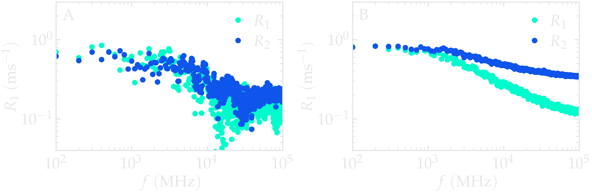
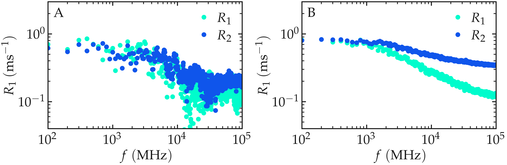

.. include:: ../additional/links.rst
.. _isotropic-label:

Isotropic system
================

In this tutorial, we compute the proton (:math:`^1\mathrm{H}`) NMR
relaxation properties of a polymer--water mixture directly from a
molecular dynamics trajectory generated using LAMMPS. We use
``NMRDfromMD`` to calculate the longitudinal and transverse relaxation
times (:math:`T_1` and :math:`T_2`), extract the frequency-dependent
relaxation rates (:math:`R_1(f)` and :math:`R_2(f)`), and separate the
intra- and intermolecular contributions to the relaxation.

By the end of this tutorial, you will understand both the basic
``NMRDfromMD`` workflow and the physical meaning of the quantities
computed by the package.

NMR relaxation originates from fluctuations of the local magnetic fields
generated by neighbouring nuclear spins. In liquids, these fluctuations
are driven by molecular motion, making relaxation measurements sensitive
to rotational diffusion, translational diffusion, and molecular
structure. Molecular dynamics simulations provide the atomic trajectories
needed to predict these relaxation properties directly.

To follow the tutorial, |MDAnalysis|, |NumPy|, and
|Matplotlib| must be installed.

.. admonition:: Note
    :class: non-title-info

    If you'd like to learn LAMMPS and generate your own trajectories, beginner
    |lammps-tutorials| are available here :cite:`gravelleSetTutorialsLAMMPS2025`.

MD system
---------

.. image:: tutorial/snapshot-dark.png
    :class: only-dark
    :alt: PEG-water mixture simulated with LAMMPS - Dipolar NMR relaxation time calculation
    :width: 250
    :align: right

.. image:: tutorial/snapshot-light.png
    :class: only-light
    :alt: PEG-water mixture simulated with LAMMPS - Dipolar NMR relaxation time calculation
    :width: 250
    :align: right

The simulated system consists of a bulk mixture containing
420 :math:`\mathrm{H_2O}` molecules and 30 :math:`\mathrm{PEG\ 300}`
polymer molecules. Water is described using the
:math:`\mathrm{TIP4P}-\epsilon` force field
:cite:`fuentes-azcatlNonPolarizableForceField2014`.
:math:`\mathrm{PEG\ 300}` denotes polyethylene glycol chains with a
molar mass of :math:`300~\mathrm{g/mol}`.

The trajectory was recorded during a
:math:`10~\text{ns}` production run performed using the open-source code
LAMMPS in the :math:`NpT` ensemble with a timestep of :math:`1~\text{fs}`.
The temperature was set to :math:`T = 300~\text{K}` and the pressure to
:math:`p = 1~\text{atm}`.

Atomic positions were saved to the ``production.xtc`` trajectory every
:math:`2~\mathrm{ps}`.

Only the saved configurations are analysed by ``NMRDfromMD``.
Consequently, the temporal resolution of the calculated correlation
functions is determined by the trajectory sampling interval
(:math:`2~\mathrm{ps}`), rather than by the
:math:`1~\mathrm{fs}` integration timestep used during the molecular
dynamics simulation. This distinction is important because all correlation
functions computed later are limited by this sampling interval.

File preparation
----------------

To access the LAMMPS input files and pre-computed trajectory data, either
download the |zip-peg-water-mixture| archive or clone the
|dataset-peg-water-mixture| repository:

.. code-block:: bash

    git clone https://github.com/NMRDfromMD/dataset-peg-water-mixture.git

The required trajectory files are located in the ``data/`` directory.

.. admonition:: Important
    :class: warning

    The trajectory files are stored using Git Large File Storage (Git LFS).
    This means that after cloning the repository, you must download the
    actual trajectory data before using it.

    If Git LFS is not installed, install it first:

.. code-block:: bash

    apt install git-lfs
    git lfs install

Then retrieve the trajectory files:

.. code-block:: bash

    git lfs pull

Alternatively, you can regenerate the trajectory by rerunning the LAMMPS
simulation scripts provided in the repository.

Import the simulation data into Python
--------------------------------------

Open a new Python script or Notebook, and define the path to the data files:

.. code-block:: python

	datapath = "mypath/polymer-in-water/data/"

Then, import ``NumPy``, ``MDAnalysis``, and the ``NMRD``
module of ``NMRDfromMD``:

.. code-block:: python

	import numpy as np
	import MDAnalysis as mda
	from nmrdfrommd import NMRD

From the trajectory files, create a ``universe`` by loading the
configuration file and trajectory:

.. code-block:: python

    u = mda.Universe(datapath+"production.data",
                     datapath+"production.xtc")

The Universe is the central object in MDAnalysis. It combines the system topology
(atom identities, masses, molecule definitions, etc.) with the time-dependent
atomic coordinates. In this tutorial, NMRDfromMD uses the Universe to access both
the molecular structure and the atomic trajectories required to compute dipolar
correlation functions and NMR relaxation properties.

Before starting the analysis, it is useful to verify that the system has been
correctly loaded and to inspect its basic composition.

.. code-block:: python

    n_TOT = u.atoms.n_residues
    n_H2O = u.select_atoms("type 6 7").n_residues
    n_PEG = u.select_atoms("type 1 2 3 4 5").n_residues

    print(f"The total number of molecules is {n_TOT} ({n_H2O} H2O, {n_PEG} PEG)")

Executing the script using Python will return:

.. code-block:: bw

    The total number of molecules is 450 (420 H2O, 30 PEG)

This output confirms that the simulation contains the expected 450 molecules,
correctly partitioned into 420 water molecules and 30 PEG chains.

Let us also print information concerning the trajectory,
namely the timestep, ``timestep`` and
the total duration of the simulation, ``total_time``:

.. code-block:: python

    timestep = np.int32(u.trajectory.dt)
    total_time = np.int32(u.trajectory.totaltime)

    print(f"The timestep is {timestep} ps")
    print(f"The total simulation time is {total_time//1000} ns")

Executing the script using Python will return:

.. code-block:: bw

    The timestep is 2 ps
    The total simulation time is 10 ns

In MDAnalysis, the ``timestep`` refers to the time interval between two
stored frames in the trajectory file, not the integration timestep used
in the molecular dynamics simulation. In this tutorial, the trajectory was generated with LAMMPS using a
1 fs integration timestep, but atomic configurations were written to the
``production.xtc`` file every 2 ps. As a result, the ``timestep`` reported by
MDAnalysis corresponds to this 2 ps sampling interval, which determines the
temporal resolution of all subsequent correlation functions and relaxation calculations.

Run the :math:`^1\text{H}` NMR relaxation analysis
--------------------------------------------------

The NMR relaxation calculation is performed on selected nuclei. Here we
create three atom groups: the hydrogen atoms belonging to PEG, the hydrogen atoms
belonging to water, and the combined set containing all hydrogen atoms:

.. code-block:: python

    H_PEG = u.select_atoms("type 3 5")
    H_H2O = u.select_atoms("type 7")
    H_ALL = H_PEG + H_H2O

Next, we run ``NMRDfromMD`` for all hydrogen atoms:

.. code-block:: python

    nmr_all = NMRD(
        u=u,
        atom_group=H_ALL,
        number_i=20)
    nmr_results = nmr_all.run_analysis()

On a standard laptop (Intel Core i9-12900H processor), this step
typically takes 1-2 minutes.

The runtime depends mainly on three factors:
(i) the number of selected reference atoms (``number_i``),
(ii) the number of atoms in the system,
and (iii) the number of saved trajectory frames.

The parameter ``number_i`` controls how many reference hydrogen atoms are
randomly selected for the calculation. Computing the dipolar interaction
for every hydrogen atom can become computationally expensive in large
systems. Instead, ``NMRDfromMD`` samples a subset of reference atoms
while retaining all neighbouring atoms.  This strategy provides an unbiased
estimate of the relaxation rates while reducing computational cost.
This sampling reduces the computational cost at the expense of increased statistical
uncertainty.

Increasing ``number_i`` improves the statistical precision of the
calculated relaxation rates, while setting ``number_i = 0`` includes all
eligible atoms in the calculation.

All calculated values are stored within the ``nmr_results`` dictionary.
Lets first extract the NMR relaxation time :math:`T_1` in
the limit :math:`f \to 0`, add the following lines to the Python script:

.. code-block:: python

    T1 = nmr_results["T1"]

    print(f"The NMR relaxation time is T1 = {T1:.2f} s")

The output should be similar to:

.. code-block:: bw

    The NMR relaxation time is T1 = 1.59 s

The exact value may vary slightly between runs because the reference
atoms are selected randomly whenever ``number_i > 0``. Increasing
``number_i`` reduces this statistical uncertainty, whereas setting
``number_i = 0`` performs the calculation for every hydrogen atom in the
selected group.

Extract the :math:`^1\text{H}`-NMR spectra
------------------------------------------

Although the zero-frequency relaxation time is often reported
experimentally, ``NMRDfromMD`` computes the complete relaxation
dispersion over a wide frequency range. The longitudinal and transverse
relaxation rates,

.. math::

   R_1(f)=\frac{1}{T_1(f)}, \qquad
   R_2(f)=\frac{1}{T_2(f)},

are available for every frequency :math:`f` (in MHz) as ``nmr_all.R1``
and ``nmr_all.R2``. The corresponding frequencies are stored in
``nmr_all.f``.

.. code-block:: python

    R1_spectrum = nmr_results["R1"]
    R2_spectrum = nmr_results["R2"]
    f = nmr_results["f"]

The spectra :math:`R_1 (f)` and :math:`R_2 (f)` can then be plotted as a
function of :math:`f` using ``pyplot``:

.. code-block:: python

    from matplotlib import pyplot as plt

    # Plot settings
    plt.figure(figsize=(8, 5))
    plt.loglog(f, R1_spectrum, 'o', label='R1', markersize=5)
    plt.loglog(f, R2_spectrum, 's', label='R2', markersize=5)
    # Labels and Title
    plt.xlabel("Frequency (MHz)", fontsize=12)
    plt.ylabel("Relaxation Rates (s⁻¹)", fontsize=12)
    # Grid and boundaries
    plt.grid(True, which="both", linestyle='--', linewidth=0.7)
    plt.xlim(80, 1e5)
    plt.ylim(0.05, 2)
    # Legend
    plt.legend()
    plt.tight_layout()
    plt.show()

The resulting spectra should resemble the figure below (panel A). For an
isotropic liquid, :math:`R_1(f)` and :math:`R_2(f)` are expected to
approach similar values in the low-frequency limit. In this regime, both relaxation
rates probe the low-frequency limit of the spectral density, which is
dominated by long-time molecular reorientations and translational diffusion.

Because only ``number_i = 20`` reference atoms are sampled here, the
spectra exhibit noticeable statistical noise. Repeating the calculation
with a larger value of ``number_i`` produces much smoother curves, as
shown in panel B.

.. container:: figurelegend

    Figure: (A) :math:`^1\text{H}`-NMR relaxation
    rates :math:`R_1` and :math:`R_2` as a
    function of the frequency :math:`f` for the 
    :math:`\text{PEG-H}_2\text{O}` bulk mixture. Results are given for
    a small value of ``number_i``, :math:`n_i = 20`.
    (B) Same quantity as in panel A, but with :math:`n_i = 1300`.

Separating intra and intermolecular
-----------------------------------

So far, the relaxation rates were calculated without distinguishing
between intra- and intermolecular interactions. One of the major
advantages of molecular dynamics simulations is that every dipolar
interaction can be classified according to whether it originates from two
nuclei within the same molecule or from two different molecules. This
separation is generally not accessible from experimental measurements
alone.

Let us extract the intramolecular contributions to the relaxation for 
both water and PEG, separately:

.. code-block:: python

    nmr_h2o_intra = NMRD(
        u=u,
        atom_group=H_H2O,
        type_analysis="intra_molecular",
        number_i=200)
    result_h2o_intra = nmr_h2o_intra.run_analysis()

    nmr_peg_intra = NMRD(
        u=u,
        atom_group=H_PEG,
        type_analysis="intra_molecular",
        number_i=200)
    result_peg_intra = nmr_peg_intra.run_analysis()

Similarly, we can also measure the intermolecular contributions:

.. code-block:: python

    nmr_h2o_inter = NMRD(
        u=u,
        atom_group=H_H2O,
        type_analysis="inter_molecular",
        number_i=20)
    result_h2o_inter = nmr_h2o_inter.run_analysis()

    nmr_peg_inter = NMRD(
        u=u,
        atom_group=H_PEG,
        type_analysis="inter_molecular",
        number_i=20)
    result_peg_inter = nmr_peg_inter.run_analysis()

The intermolecular contribution is
computed only between molecules belonging to the same chemical species.
For example, ``nmr_h2o_inter`` includes interactions between different
water molecules, but not between water and PEG molecules.

The water-PEG intermolecular contribution can be computed by selecting
water hydrogen atoms as the reference group (``atom_group``) and PEG
hydrogen atoms as the interacting partner group (``neighbor_group``):

.. code-block:: python

    nmr_h2o_peg = NMRD(
        u=u,
        atom_group=H_H2O,
        neighbor_group=H_PEG,
        number_i=20)
    result_h2o_peg = nmr_h2o_peg.run_analysis()

In this case, the analysis is already restricted to intermolecular
interactions between two different molecular species. Therefore, it is
not necessary to explicitly set ``type_analysis="inter_molecular"``.

Comparing the calculated spectra reveals that the
intramolecular contribution is larger than the intermolecular one for
this system. More importantly, the two contributions exhibit distinct
frequency dependences because they originate from different molecular
motions. Intramolecular relaxation is mainly governed by rotational motion and
internal molecular flexibility, whereas intermolecular relaxation reflects
translational diffusion and inter-molecular collisions.

.. image:: isotropic-system/nmr-intra-dm.png
    :class: only-dark
    :alt: NMR results obtained from the LAMMPS simulation of water

.. image:: isotropic-system/nmr-intra.png
    :class: only-light
    :alt: NMR results obtained from the LAMMPS simulation of water

.. container:: figurelegend

    Figure: Intramolecular :math:`^1\text{H}`-NMR
    relaxation rates :math:`R_{1 \text{R}}` (A) and
    Intermolecular :math:`^1\text{H}`-NMR relaxation
    rates :math:`R_{1 \text{T}}` (B) as a
    function of the frequency :math:`f` for 
    PEG and :math:`\text{H}_2\text{O}` separately.
    Results are shown for :math:`n_i = 1280`.
