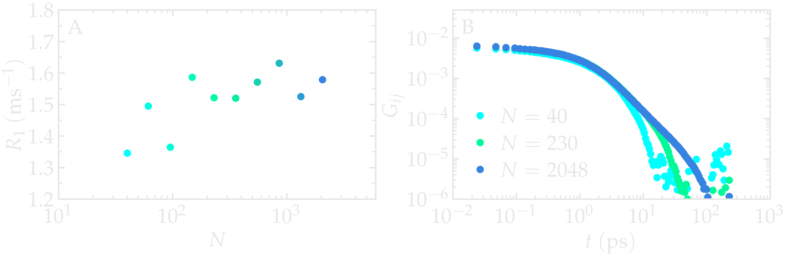
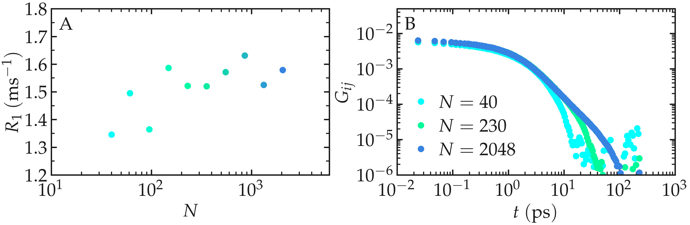

Best practices
==============

Here, a set of best practices for performing accurate dipolar NMR
calculations from moelcular dynamics simulation is provided.

Choosing the Force Field
------------------------

The agreement between experiments and simulations can only be as accurate as
the force field used. While some force fields show excellent agreement with
experimental data -- for instance, in simulations of water, hydrocarbons, or
polymer melts
:cite:`singerMolecularDynamicsSimulations2017,gravelleNMRInvestigationWater2023,gravelleAssessingValidityNMR2023`
-- it is important to remember that force fields are often parametrized to
reproduce thermodynamic properties, such as solvation energy. However, NMR
relaxation times depend on both structural and dynamical quantities. Thus,
substantial discrepancies between simulations and experiments may occur with
inaccurate force fields.

As an example, the NMR relaxation time :math:`T_1` of bulk water was measured
as a function of temperature for three water models:
:math:`\text{TIP4P}-\epsilon` :cite:`fuentes-azcatlNonPolarizableForceField2014`,
:math:`\text{SPC/E}` :cite:`berendsenMissingTermEffective1987`, and
:math:`\text{TIP3P}` :cite:`jorgensenComparisonSimplePotential1983`.
Our results show that the :math:`\text{TIP4P}-\epsilon` model is in excellent
agreement with experimental measurements by Krynicki et al.
:cite:`krynickiProtonSpinlatticeRelaxation1966` and Hindman et al.
:cite:`hindmanRelaxationProcessesWater2003`. By contrast, both
:math:`\text{SPC/E}` and :math:`\text{TIP3P}` overestimate the relaxation time
:math:`T_1`, consistent with earlier results by Calero et al.
:cite:`calero1HNuclearSpin2015`.

Note that Calero et al. used the :math:`\text{TIP4P}-2005` model rather than
:math:`\text{TIP4P}-\epsilon`, but the two models yield very similar structures
and viscosities :cite:`fuentes-azcatlNonPolarizableForceField2014` and are thus
expected to produce similar relaxation times.

.. image:: ../figures/illustrations/bulk-water/experimental_comparison-dark.png
    :class: only-dark
    :alt: NMR results obtained from the LAMMPS simulation of water

.. image:: ../figures/illustrations/bulk-water/experimental_comparison-light.png
    :class: only-light
    :alt: NMR results obtained from the LAMMPS simulation of water

.. container:: figurelegend

    Figure: NMR relaxation time :math:`T_1` from MD simulations of bulk water
    using three water models:
    :math:`\text{TIP4P}-\epsilon` :cite:`fuentes-azcatlNonPolarizableForceField2014`,
    :math:`\text{SPC/E}` :cite:`berendsenMissingTermEffective1987`, and
    :math:`\text{TIP3P}` :cite:`jorgensenComparisonSimplePotential1983`. Results
    are compared with experiments by Krynicki et al.
    :cite:`krynickiProtonSpinlatticeRelaxation1966` and Hindman et al.
    :cite:`hindmanRelaxationProcessesWater2003`.

Simulation accuracy
-------------------

NMR relaxation measurements are sensitive to both thermodynamic and dynamic
properties. To ensure accurate simulations, key parameters must be carefully
chosen - including the force field (as discussed above), the integration time
step, cutoff distances, and the simulation length
:cite:`frenkelUnderstandingMolecularSimulation2002, allenComputerSimulationLiquids2017`.

As an illustration, the NMR relaxation time :math:`T_1`
of bulk water was measured as a function of the LJ cut-off.
Our results show that, for the smallest cut-off,
the inter-molecular :math:`T_1^\text{inter}` is slightly
under-estimated, which is mainly due to an over-estimation
of the inter-molecular characteristic time :math:`\tau_\text{inter}`.
Our results also indicate that for a cut-off of 1\,nm,
which is commonly used value, a small error of 
about 1\,\% is induced. These observations are consistent
with previous measurements :cite:`gravelleNMRInvestigationWater2023`,
and confirm that care must be taken if one attempt in reproducing
accurately NMR quantities.

.. image:: ../figures/illustrations/bulk-water/effect_cutoff-dark.png
    :class: only-dark
    :alt: NMR results obtained from the LAMMPS simulation of water

.. image:: ../figures/illustrations/bulk-water/effect_cutoff-light.png
    :class: only-light
    :alt: NMR results obtained from the LAMMPS simulation of water

.. container:: figurelegend

    Figure: a) Inter-molecular NMR relaxation time :math:`T_1^\text{inter}`
    as a function of the LJ cut-off for a bulk water system.
    b) Inter-molecular characteristic time :math:`\tau_\text{inter}`
    as a function of LJ cut-off.

Box size
--------

NMR relaxation measurements are sensitive to the 
finite-size effects that can occur with small simulation
boxes :cite:`grivetNMRRelaxationParameters2005`. Small
simulation boxes impose a cut-off to the maximum time of
first return trajectory, :math:`\tau_\text{cut-off} \sim L^2 / D`,
where :math:`L` is the box size and :math:`D` the diffusion
coefficient. 

As an illustration, the NMR relaxation rate :math:`R_1`
was measured for water with different number of molecules
:math:`N \in [100,\,10000]`, which correspond to equilibrium
box of lateral sizes :math:`L \in [1.4,\,6.7]\,\text{nm}`.
Our results show that the inter-molecular
relaxation rate :math:`R_1^\text{inter}` is sensitive to the 
box size even for the largest boxes considered here.
With small box size, the tail of :math:`G_\text{inter}`, 
which decreases as :math:`G_\text{inter} \sim t^{-3/2}`, is cutoff
which lead to an error on :math:`R_1^\text{inter}`.
Note that :math:`R_1^\text{intra}`, which is the dominant contribution to 
:math:`R_1` for water at ambient temperature, is barely affected
by the box size and therefore the resulting error induced on the 
total relaxation rate :math:`R_1` remains small for :math:`N > 1000`.

.. container:: figurelegend

    Figure: a) Inter-molecular NMR relaxation rate :math:`R_1^\text{inter}` as a function of the number of molecules :math:`N`
    for a bulk water system. For the smallest systems, results were averaged
    from up to 10 independent simulations and the error bar is calculated from
    the standard deviation. b) Inter-molecular correlation function :math:`G_\text{inter}`
    for two different numbers of molecules.

Dumping frequency
-----------------

The dumping frequency sets the temporal resolution of the analysis.
The maximum dumping period that can be used is system-dependent
and must typically be much smaller than the correlation times.
If the typical correlation times in the system is not known,
the appropriate dumping frequency :math:`\Delta t` can
be identified from convergence testing.
Note however than using a high dumping frequency
increases the size of the trajectory files, which in turn
can make the computation of NMR relaxation rates
computationally expensive.

As an illustration, the NMR relaxation time :math:`T_1` was measured
for an increasing dumping period from :math:`\Delta t = 0.02\,\text{ps}`
to :math:`5\,\text{ps}`. Our results show that using a dumping period
larger than about :math:`\Delta t = 0.5\,\text{ps}` leads to a significant decrease
of the measured relaxation time :math:`T_1`. The decrease in :math:`T_1`
is accompanied by an increase of the measured inter-molecular
relaxation times :math:`\tau_\text{inter}`. 

.. image:: ../figures/illustrations/bulk-water/effect_dumping_frequency-dark.png
    :class: only-dark
    :alt: NMR results obtained from the LAMMPS simulation of water

.. image:: ../figures/illustrations/bulk-water/effect_dumping_frequency-light.png
    :class: only-light
    :alt: NMR results obtained from the LAMMPS simulation of water

.. container:: figurelegend

    Figure: a) Convergence testing showing the NMR relaxation time :math:`T_1`
    as a function of the trajectory dumping frequency :math:`\Delta t`
    for a bulk water system at :math:`T = 300 \text{K}`.
    The dashed line show the value for :math:`T_1`
    for :math:`\Delta t \to 0`.
    b) Inter-molecular relaxation times :math:`\tau_\text{inter}` as 
    a function of :math:`\Delta t`.
