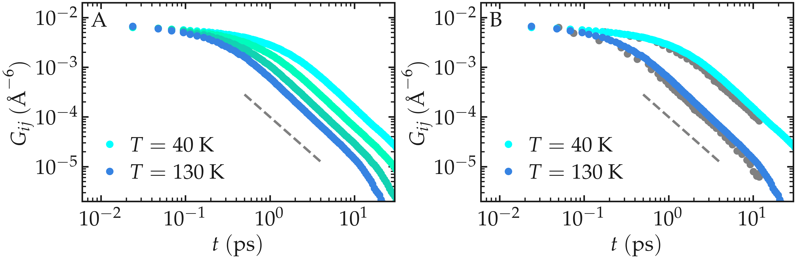
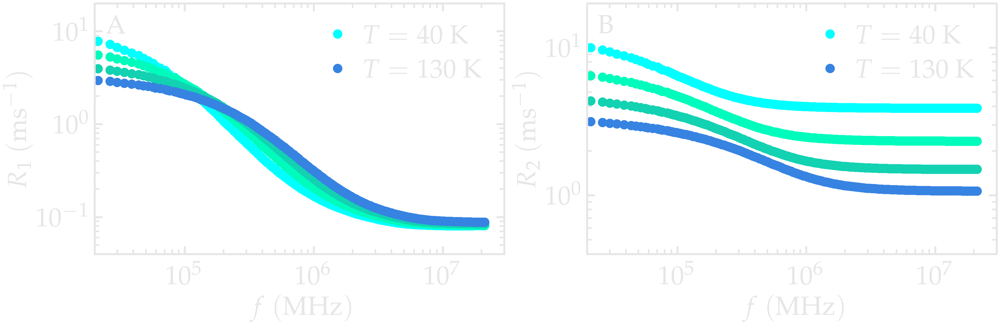
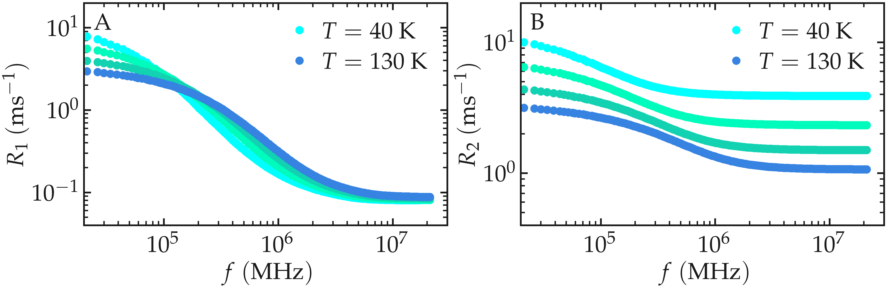
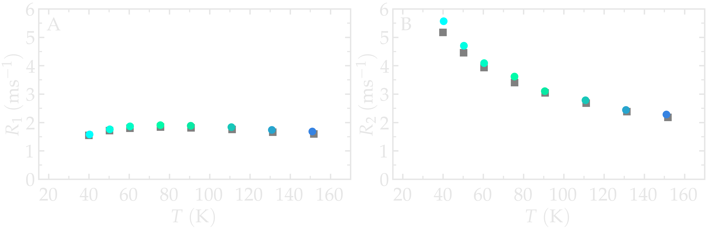
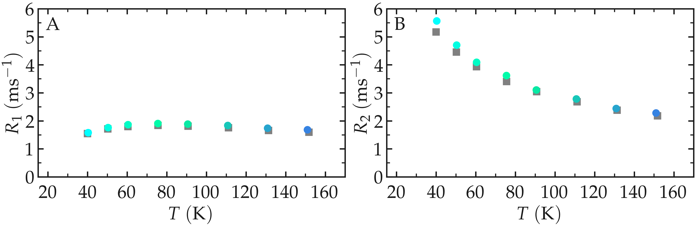

.. include:: ../additional/links.rst
.. _lennard-jones-label:

Simple fluid
============

Here, NMR relaxation rates are measured from a bulk Lennard-Jones (LJ) fluid.
The advantage of LJ fluids, compared to molecular systems made of molecules with more than
one atom bearing the spin in interest, is the absence of intramolecular
contribution to the NMR relaxation. To validate the method, results are
compared to Ref. :cite:`grivetNMRRelaxationParameters2005`.

System
------

.. image:: lennard-jones-fluids/lj-light.png
    :class: only-light
    :alt: LJ fluid simulated with LAMMPS - Dipolar NMR relaxation time calculation
    :width: 250
    :align: right

The system consists of 16,000 particles interacting via the classical 
Lennard-Jones (LJ) 12-6 potential and simulated using
LAMMPS :cite:`thompsonLAMMPSFlexibleSimulation2022`.
Each particle has a mass 
:math:`m = 1\,\text{g/mol}`, and LJ parameters 
:math:`\sigma = 3\,\text{Å}` and :math:`\epsilon = 0.1\,\text{kcal/mol}`.
All reduced parameters were taken to match the study by Grivet 
:cite:`grivetNMRRelaxationParameters2005`. Specifically,
a cutoff of :math:`4 \sigma` was used for the LJ interactions, the 
simulation box has a volume of :math:`(26.9~\sigma)^3` to match 
the reduced density of :math:`\rho^* = 0.84`.
Production runs were performed in the microcanonical (NVE) ensemble, 
during which 100,000 timesteps were executed, equivalent to 500 times 
the reference time :math:`\sqrt{m \sigma^2/\epsilon}`. Configurations 
were recorded every 10 timesteps. A timestep of 
:math:`0.005\,\sqrt{m \sigma^2/\epsilon}` was used.
The imposed temperatures ranged from :math:`T = 30` to 
:math:`160\,\text{K}`, corresponding to reduced temperatures from 
:math:`T^* = 0.8` to :math:`3.0`.

All LAMMPS input scripts and analysis scripts written in Python are provided
on GitHub; see |dataset-LJ-fluid|.

Reproducing Grivet's results for a simple fluid
-----------------------------------------------

The correlation function :math:`G_{ij}^{(0)}` was first extracted for all
temperatures. For the two extreme values of :math:`T`, namely
:math:`T = 50` and :math:`140\,\text{K}`, the functions
:math:`G_{ij}^{(0)}` are compared with the correlation functions reported by
Grivet :cite:`grivetNMRRelaxationParameters2005`. Our results show good
agreement with those of Grivet, with however some differences observed at the lowest
temperature. The results show that :math:`G_{ij}^{(0)}` shifts to longer times as the
temperature decreases, as expected from the slowing down of molecular motion.

.. container:: figurelegend

    Figure: A) Correlation function :math:`G_{ij}^{(0)}` as extracted from the LJ
    fluid simulation for all temperatures. B) Correlation function,:math:`G_{ij}^{(0)}`,
    for two different temperatures compared with the data from Grivet
    :cite:`grivetNMRRelaxationParameters2005` (gray squares). The dashed
    line shows :math:`\propto t^{-3/2}`.

The NMR relaxation rate spectra :math:`R_1` and :math:`R_2` were extracted for
all temperatures using ``NMRDforMD``. For all temperatures, the spectra show
a decrease with increasing frequency :math:`f`.

.. container:: figurelegend

    Figure: NMR relaxation rates :math:`R_1` (A) and :math:`R_2` (B)
    as a function of the frequency :math:`f`.

The NMR relaxation rates :math:`R_1` and :math:`R_2` were also extracted for
all temperatures, at a frequency :math:`f_0 = 150\,\text{GHz}` (or 0.07 in
dimensionless units). :math:`R_1(f_0)` shows a maximum at intermediate
temperature and a minimum at the lowest temperature.
:math:`R_1(f_0)` decreases with increasing temperature. Our results show good
agreement with the data from Grivet :cite:`grivetNMRRelaxationParameters2005`.

.. container:: figurelegend

    Figure: NMR relaxation rates :math:`R_1` (A) and :math:`R_2` (B) at
    the target frequency 0.07 (dimensionless), or :math:`f_0 = 151\,\text{GHz}`.
    The data from Grivet :cite:`grivetNMRRelaxationParameters2005` are shown
    with gray symbols.
