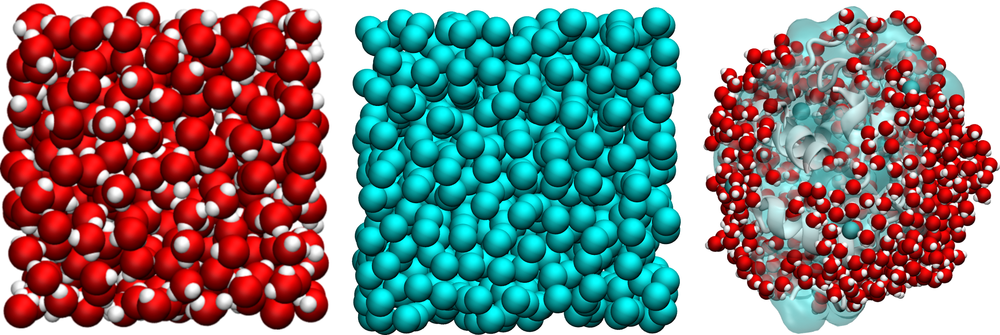

.. include:: additional/links.rst

NMRDfromMD
==========

NMRDfromMD is a Python toolkit that computes the longitudinal (:math:`T_1`)
and transverse (:math:`T_2`) NMR relaxation times from the dipolar interaction
between nuclear spins. These quantities are sensitive to molecular dynamics across a broad range of
timescales, making them a powerful probe of translational and rotational motion
in liquids, confined fluids, polymers, and biological systems. Used in combination
with experiments, NMRDfromMD enables the validation of
numerical models and helps identify the molecular mechanisms underlying
relaxation. In the absence of experimental data, it can be used to
interpret and predict NMR relaxation behavior from molecular dynamics
simulations alone.

Compatible Simulation Packages
-------------------------------

NMRDfromMD accepts any trajectory format supported by MDAnalysis,
covering virtually all major MD simulation packages including
|LAMMPS|, |GROMACS|, NAMD, AMBER, CHARMM, and many others.
For a full list of supported formats, see the |MDAnalysis| documentation.

This package builds on the now discontinued |NMRforMD|.

.. container:: figurelegend

   Figure: NMRDfromMD can be applied to a wide range of systems, from
   simple bulk fluids (water, left) to structureless Lennard-Jones models
   (center) and complex biomolecular environments such as a lysozyme protein
   surrounded by a hydration shell (right).

Installation
------------

..
    Install the latest published version
    ------------------------------------

    To install the latest stable release, run the following command in a terminal:

    .. code-block:: bash

        pip install nmrdfrommd

Install the development version
~~~~~~~~~~~~~~~~~~~~~~~~~~~~~~~

To install the latest development version of NMRDfromMD, clone the repository,
|NMRDfromMD-code|, from GitHub, and use ``pip`` from the main directory:

.. code-block:: bash

    git clone https://github.com/NMRDfromMD/nmrdfrommd.git

    cd nmrdfrommd/

    pip install .

Run the tests
~~~~~~~~~~~~~

To run the test suite, install the testing dependencies:

.. code-block:: bash

    pip install pytest coverage

Then run from the tests folder:

.. code-block:: bash

    pytest

Datasets
--------

Two molecular dynamics datasets are available on GitHub: a |polymer in water|
system generated using LAMMPS, and a |water confined in silica| system
generated using GROMACS. These datasets can be downloaded to follow the
tutorials or simply to test NMRDfromMD.

.. toctree::
   :maxdepth: 2
   :caption: Theory
   :hidden:

   theory/context
   theory/theory

.. toctree::
   :maxdepth: 2
   :caption: Applications
   :hidden:

   applications/tutorial
   applications/lennard-jones-fluids
   applications/bulk-water
   applications/lysozyme-in-water
   applications/anisotropic-system

.. toctree::
   :maxdepth: 2
   :caption: Best practices
   :hidden:

   theory/best-practice

.. toctree::
   :maxdepth: 2
   :caption: Additional
   :hidden:

   additional/bibliography
   additional/acknowledgments
