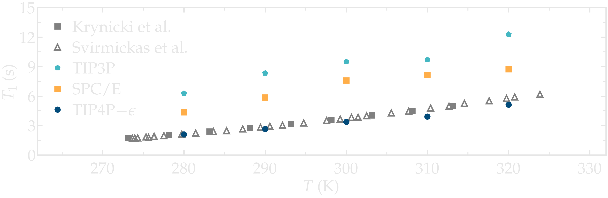
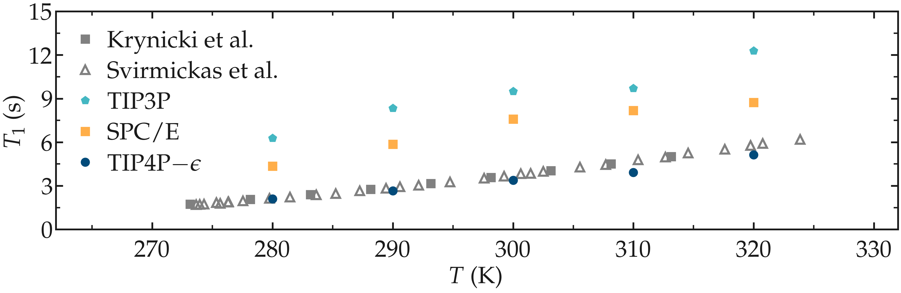
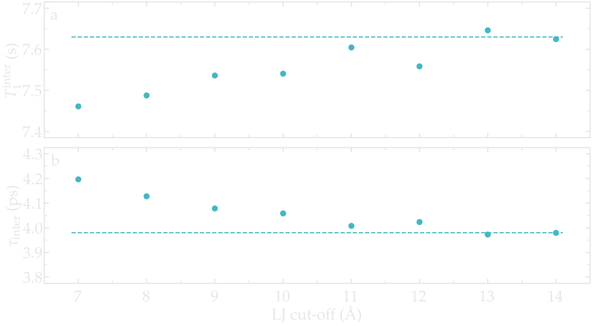
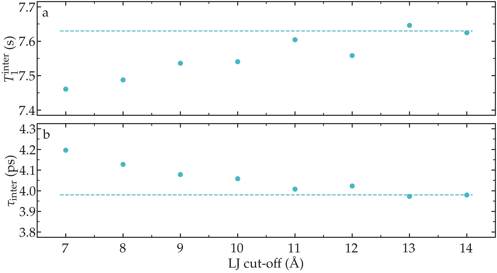
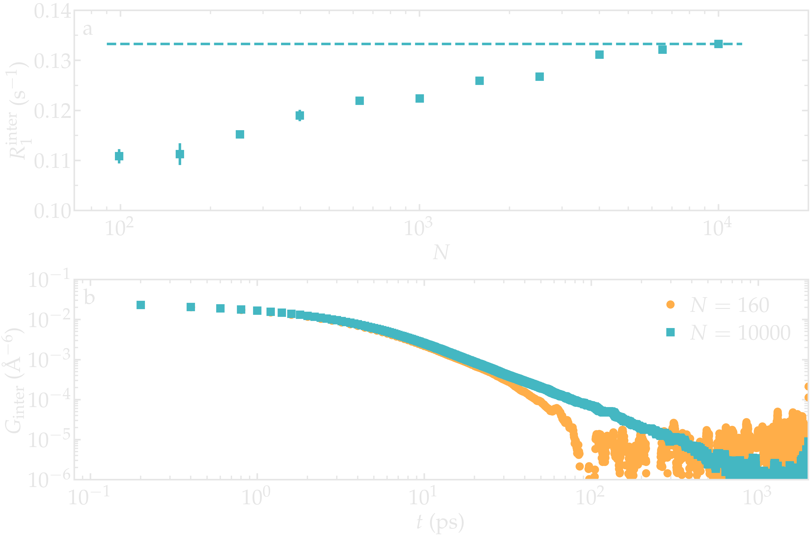
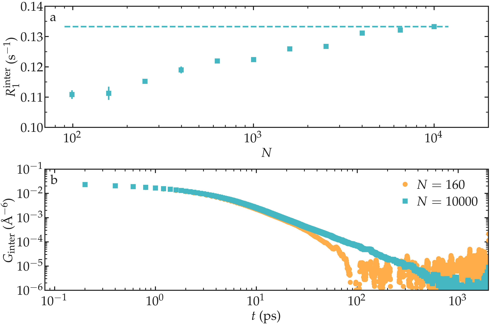
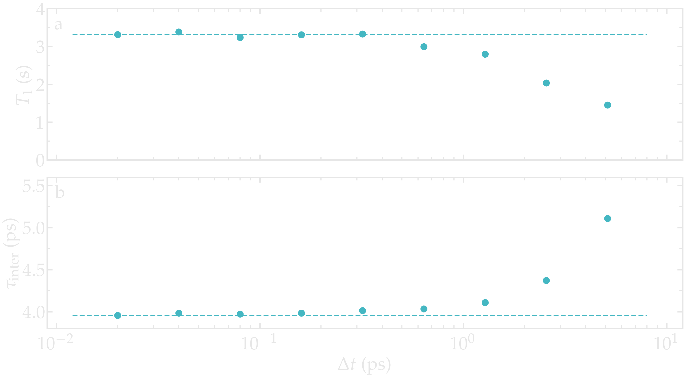
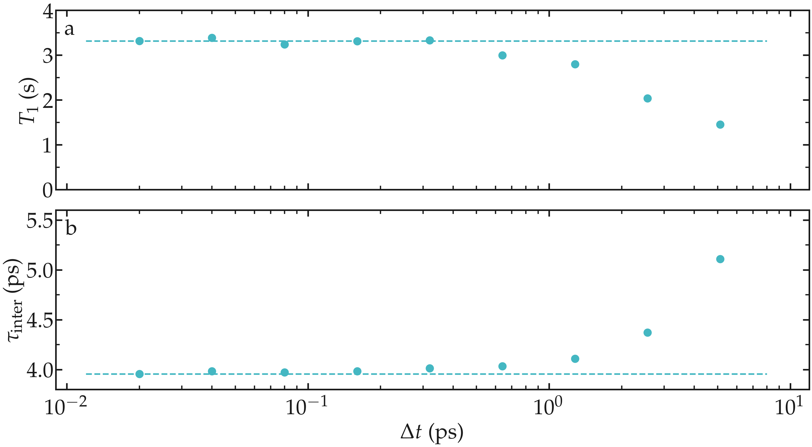

Best practices
==============

Here, a set of best practices for performing accurate dipolar NMR
calculations from MD is provided.

Simulation length
-----------------

The minimum simulation duration required to accurately calculate the NMR relaxation rate (e.g., :math:`R_1`)
depends on the quantity of interest. To obtain a converged value of :math:`R_1` in the zero-frequency limit,
the trajectory must be long enough for the correlation function
:math:`G(t)` to fully decay to zero, meaning the simulation duration
must significantly exceed the longest correlation time :math:`\tau_c`
of the system. For frequency-dependent quantities :math:`R_1(f)`, the
lowest accessible frequency is bounded by :math:`f_\text{min} \sim 1/T_\text{sim}`,
where :math:`T_\text{sim}` is the total simulation
duration. Frequencies below :math:`f_\text{min}` cannot be probed
regardless of the trajectory sampling interval. In practice, convergence
can be verified by comparing results obtained from simulations of
increasing duration.

Choosing the force field
------------------------

The agreement between experiments and simulations can only be as accurate as
the force field used. While some force fields show excellent agreement with
experimental data -- for instance, in simulations of water, hydrocarbons, or
polymer melts
:cite:`singerMolecularDynamicsSimulations2017,gravelleNMRInvestigationWater2023,gravelleAssessingValidityNMR2023`
-- it is important to remember that force fields are often parametrized to
reproduce thermodynamic properties, such as solvation energy. However, NMR
relaxation times depend on both structural and dynamical quantities. Thus,
substantial discrepancies between simulations and experiments may occur with
inaccurate force fields.

As an example, the NMR relaxation time :math:`T_1` of bulk water was measured
as a function of temperature for three water models:
:math:`\text{TIP4P}-\epsilon` :cite:`fuentes-azcatlNonPolarizableForceField2014`,
:math:`\text{SPC/E}` :cite:`berendsenMissingTermEffective1987`, and
:math:`\text{TIP3P}` :cite:`jorgensenComparisonSimplePotential1983`.
Our results show that the :math:`\text{TIP4P}-\epsilon` model is in excellent
agreement with experimental measurements by Krynicki et al.
:cite:`krynickiProtonSpinlatticeRelaxation1966` and Hindman et al.
:cite:`hindmanRelaxationProcessesWater2003`. By contrast, both
:math:`\text{SPC/E}` and :math:`\text{TIP3P}` overestimate the relaxation time
:math:`T_1`, consistent with earlier results by Calero et al.
:cite:`calero1HNuclearSpin2015`.

Note that Calero et al. used the :math:`\text{TIP4P}-2005` model rather than
:math:`\text{TIP4P}-\epsilon`, but the two models yield very similar structures
and viscosities :cite:`fuentes-azcatlNonPolarizableForceField2014` and are thus
expected to produce similar relaxation times.

.. container:: figurelegend

    Figure: NMR relaxation time :math:`T_1` from MD simulations of bulk water
    using three water models:
    :math:`\text{TIP4P}-\epsilon` :cite:`fuentes-azcatlNonPolarizableForceField2014`,
    :math:`\text{SPC/E}` :cite:`berendsenMissingTermEffective1987`, and
    :math:`\text{TIP3P}` :cite:`jorgensenComparisonSimplePotential1983`. Results
    are compared with experiments by Krynicki et al.
    :cite:`krynickiProtonSpinlatticeRelaxation1966` and Hindman et al.
    :cite:`hindmanRelaxationProcessesWater2003`.

Simulation accuracy
-------------------

NMR relaxation measurements are sensitive to both thermodynamic and dynamic
properties. To ensure accurate simulations, several parameters must be
carefully chosen, including the force field (as discussed above), the
integration timestep, the cutoff distances, the choice of thermostat and
barostat, and the equilibration procedure
:cite:`frenkelUnderstandingMolecularSimulation2002,allenComputerSimulationLiquids2017`.
Too large an integration timestep introduces errors in the equations of
motion, insufficient cutoff distances truncate relevant pair correlations,
and an inappropriate thermostat coupling constant can artificially affect
dynamical properties at short times.

As an illustration of the effect of cutoff distance, the NMR relaxation
time :math:`T_1` of bulk water was measured as a function of the LJ
cutoff. For the smallest cutoff, the inter-molecular contribution
:math:`T_1^\text{inter}` is slightly underestimated, primarily due to
an overestimation of the inter-molecular characteristic time
:math:`\tau_\text{inter}`. For a cutoff of :math:`1\,\text{nm}`, which
is a commonly used value, a small error of approximately :math:`1\,\%`
is induced. These observations are consistent with previous measurements
:cite:`gravelleNMRInvestigationWater2023`, and confirm that care must
be taken when attempting to accurately reproduce NMR relaxation quantities.

.. container:: figurelegend

    Figure: a) Inter-molecular NMR relaxation time :math:`T_1^\text{inter}`
    as a function of the LJ cut-off for a bulk water system.
    b) Inter-molecular characteristic time :math:`\tau_\text{inter}`
    as a function of LJ cut-off.

Box size
--------

NMR relaxation measurements are sensitive to the 
finite-size effects that can occur with small simulation boxes :cite:`grivetNMRRelaxationParameters2005`.

As an illustration, the NMR relaxation rate :math:`R_1`
was measured for water with different number of molecules
:math:`N \in [100,\,10000]`, which correspond to equilibrium
box of lateral sizes :math:`L \in [1.4,\,6.7]\,\text{nm}`.
Our results show that the inter-molecular
relaxation rate :math:`R_1^\text{inter}` is sensitive to the 
box size even for the largest boxes considered here.
With small box size, the tail of :math:`G_\text{inter}`, 
which decreases as :math:`G_\text{inter} \sim t^{-3/2}`, is cutoff
which lead to an error on :math:`R_1^\text{inter}`.
Note that :math:`R_1^\text{intra}`, which is the dominant contribution to 
:math:`R_1` for water at ambient temperature, is barely affected
by the box size and therefore the resulting error induced on the 
total relaxation rate :math:`R_1` remains small for :math:`N > 1000`.

.. container:: figurelegend

    Figure: a) Inter-molecular NMR relaxation rate :math:`R_1^\text{inter}` as a function of the number of molecules :math:`N`
    for a bulk water system. For the smallest systems, results were averaged
    from up to 10 independent simulations and the error bar is calculated from
    the standard deviation. b) Inter-molecular correlation function :math:`G_\text{inter}`
    for two different numbers of molecules.

Output frequency
----------------

The trajectory output frequency sets the temporal resolution of the
analysis and determines the shortest correlation times that can be
resolved. The sampling interval :math:`\Delta t` must be significantly
smaller than the shortest relevant correlation time in the system,
otherwise fast molecular motions are not captured and the correlation
function :math:`G(t)` is undersampled. This leads to an overestimation
of the characteristic times :math:`\tau`, and consequently to errors
in the computed relaxation rates. If the characteristic correlation
times of the system are not known a priori, the appropriate
:math:`\Delta t` should be identified from convergence testing.
Note that a small sampling interval increases the size of the
trajectory files and the computational cost of the analysis.

As an illustration, the NMR relaxation time :math:`T_1` of bulk water
was measured for sampling intervals ranging from
:math:`\Delta t = 0.02\,\text{ps}` to :math:`5\,\text{ps}`. Using a
sampling interval larger than approximately :math:`\Delta t =
0.5\,\text{ps}` leads to a significant underestimation of :math:`T_1`,
accompanied by an overestimation of the inter-molecular characteristic
time :math:`\tau_\text{inter}`. Both effects are consistent with
insufficient sampling of fast rotational and translational motions of
the water molecules.

.. container:: figurelegend

    Figure: a) Convergence testing showing the NMR relaxation time :math:`T_1`
    as a function of the trajectory dumping frequency :math:`\Delta t`
    for a bulk water system at :math:`T = 300 \text{K}`.
    The dashed line show the value for :math:`T_1`
    for :math:`\Delta t \to 0`.
    b) Inter-molecular relaxation times :math:`\tau_\text{inter}` as 
    a function of :math:`\Delta t`.

Number of reference atoms
-------------------------

The parameter ``number_i`` controls how many reference atoms are randomly
sampled during the calculation. Because the selection is stochastic,
results will vary slightly between runs when ``number_i > 0``. The
statistical uncertainty decreases as ``number_i`` increases, and
setting ``number_i = 0`` includes all eligible atoms, providing the
most accurate result at the highest computational cost. In practice,
convergence should be verified by repeating the calculation with
increasing values of ``number_i`` until the relaxation rates stabilize.

Cross-species interactions
--------------------------

When ``neighbor_group`` is not specified, intermolecular contributions
are computed only between atoms belonging to the same chemical species.
In a mixture such as polymer--water, this means that water--polymer
cross-interactions are excluded from the relaxation calculation. If
cross-species contributions are expected to be significant, the
appropriate ``neighbor_group`` must be set explicitly. Neglecting
these contributions may lead to an underestimation of the total
intermolecular relaxation rate.
