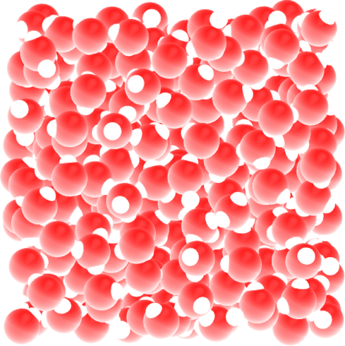
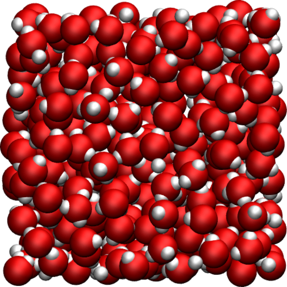
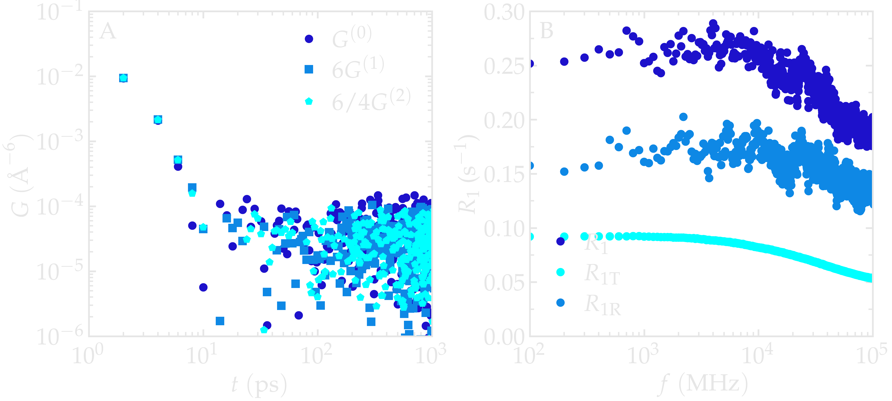
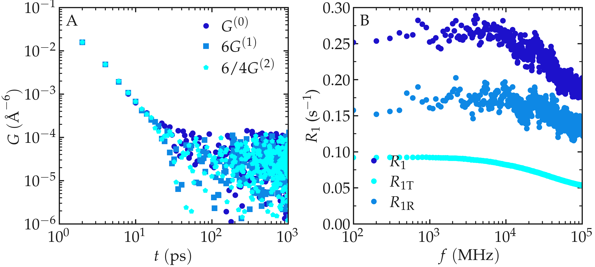
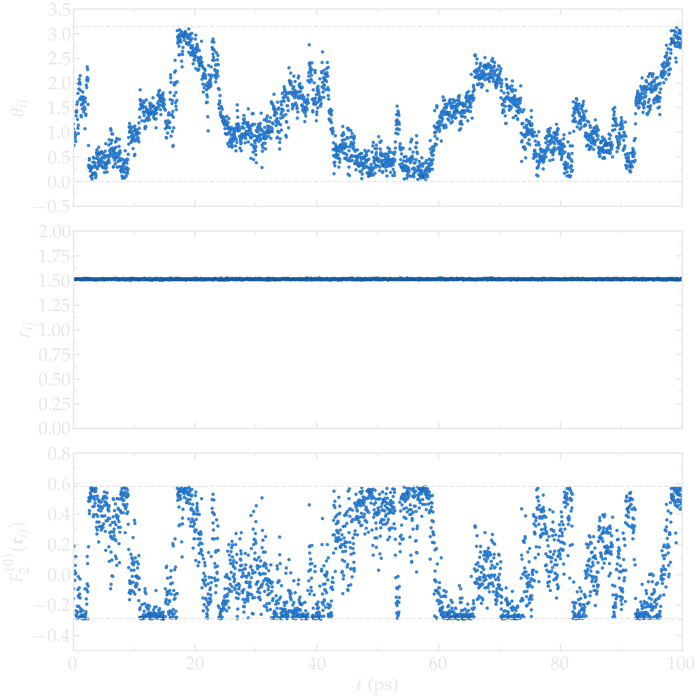
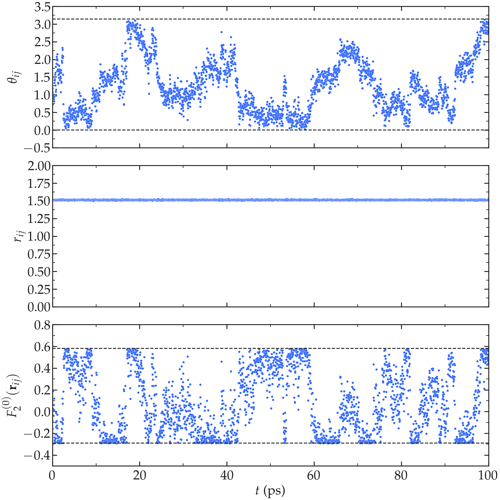
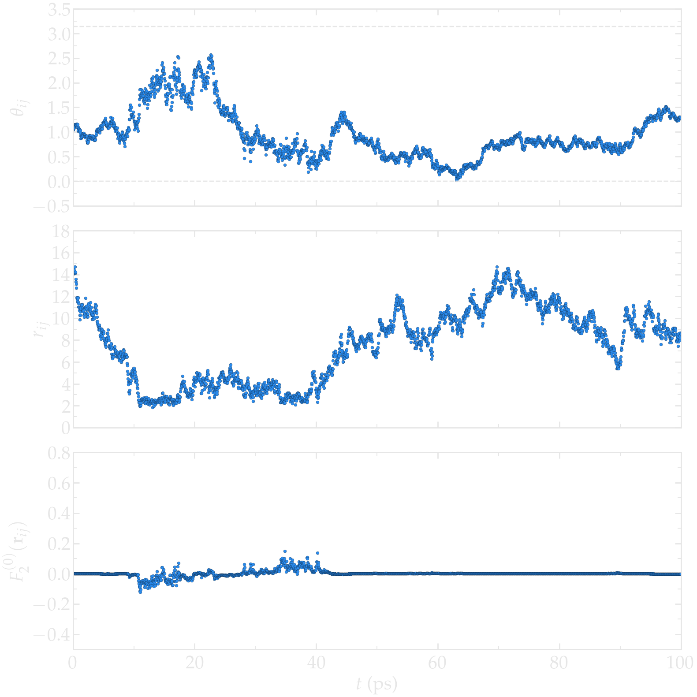
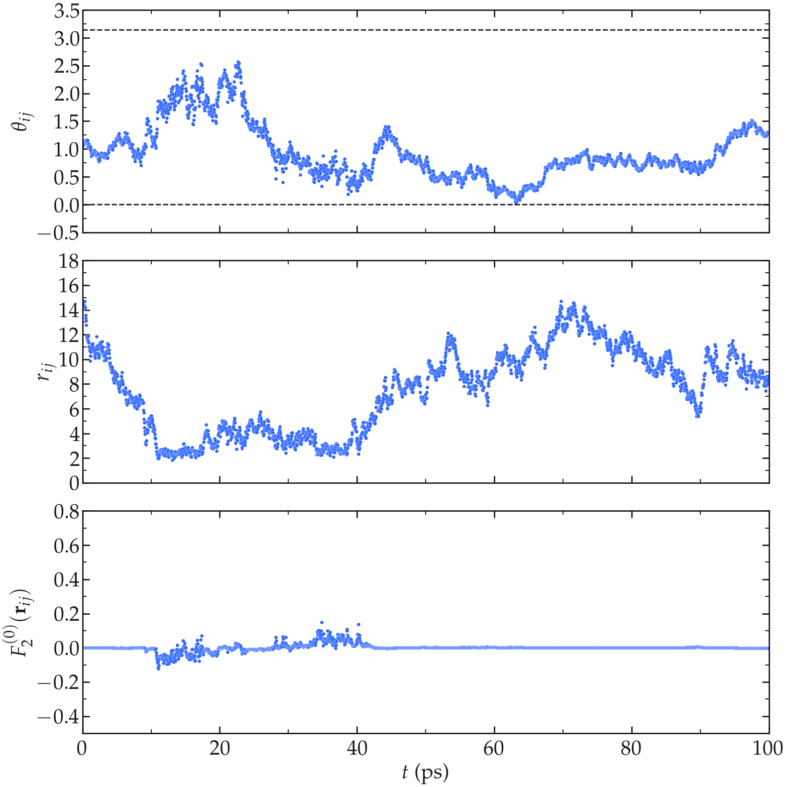
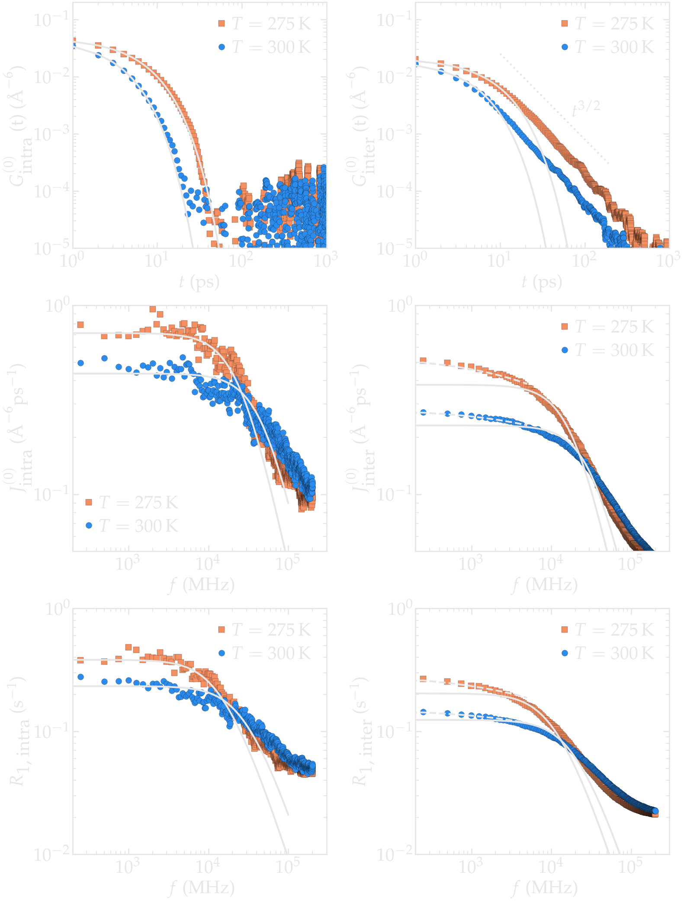
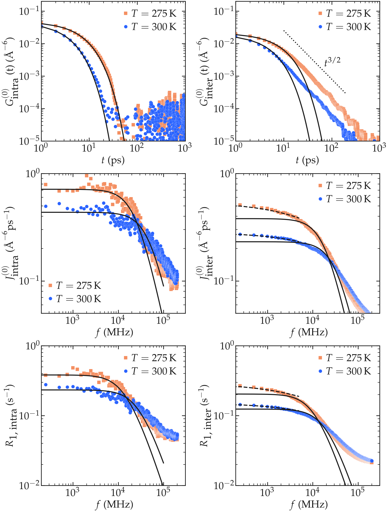

.. _bulk-water-label:

Microscopic origin of relaxation
================================

This section illustrates how the microscopic motions observed in a
molecular dynamics trajectory give rise to the macroscopic
:math:`^1\mathrm{H}`-NMR relaxation rates measured experimentally.
Using bulk liquid water as a simple example, we follow the complete
chain of quantities entering the relaxation calculation, from the
motion of individual pairs of nuclei to the dipolar correlation
functions and, finally, to the relaxation spectra.

Throughout this section, intramolecular and intermolecular
contributions are analysed separately, highlighting how rotational and
translational molecular motions contribute differently to NMR
relaxation.

MD system
---------

The system is a bulk liquid water with a number :math:`N` of water molecules,
where :math:`N` was varied from 25 to 4000. The simulation box was cubic, 
with equilibrium dimensions ranging from :math:`(0.9\,\text{nm})^3`
to :math:`(4.9\,\text{nm})^3`. The trajectory was recorded
during a :math:`8\,\text{ns}` production run performed with
the open source codes LAMMPS (for the smallest systems) and GROMACS (for the largest systems).
Simulations were performed in the NPT ensemble using a timestep of :math:`2\,\text{fs}`.
The imposed temperature was :math:`T = 300 \text{K}`, and the pressure
:math:`p = 1\,\text{atm}`. The positions of the atoms were recorded in the *prod.xtc* file
every :math:`\Delta t`, with :math:`\Delta t` ranging from :math:`0.2\,\text{ps}` to :math:`32\,\text{ps}`.

Results
-------

Before analysing the molecular dynamics, we first verify one of the
central assumptions used throughout the package. For isotropic bulk
liquids, the three second-rank dipolar correlation functions are
expected to satisfy :cite:`hubbardTheoryNuclearMagnetic1963`

.. math::
    
    G^{(0)} = 6 G^{(1)} = \frac{6}{4} G^{(2)}.

For an isotropic bulk liquid, no direction in space is preferred.
The three correlation functions :math:`G^{(m)}` differ only by their
spherical harmonic order :math:`m = 0, 1, 2`. Because all orientations
are equally probable, the orientation average cannot depend on :math:`m`,
and the functions :math:`G^{(m)}` are therefore proportional to one
another. The numerical prefactors :math:`1, 6, 6/4` arise solely from
the explicit forms of the rank-2 spherical harmonics :math:`Y_2^m`,
whose squared moduli satisfy
:math:`|Y_2^0|^2 : |Y_2^1|^2 : |Y_2^2|^2 = 1 : 3 : 3`, combined with
the symmetry factor accounting for :math:`m` > 0 pairs.

Verifying this proportionality provides a simple consistency check
before analysing the relaxation spectra. A similar bencmark was done, for instance
in Ref. :cite:`becherMolecularDynamicsSimulations2021` with glycerol. Our results
show that the proportionality relation is well verified (See figure below).

.. container:: figurelegend

    Figure: A) Comparison between :math:`G^{(0)}`, :math:`6 G^{(1)}` and :math:`\frac{6}{4} G^{(2)}`
    obtained from a bulk water molecular dynamics. B) Relaxation rate, :math:`R_1`, 
    as a function of the frequency :math:`f`.

The inter-molecular correlation function shows the expected power law at longer time,
while the intra-molecular correlation decreases faster with time.

Our results also show that the relaxation is dominated by intra-molecular contribution,
as expected for water under ambient conditions :cite:`singerMolecularDynamicsSimulations2017`.
For the lowest frequency considered here, the spectrum :math:`R_1` is almost flat.

To understand the origin of these relaxation spectra, it is useful to
return to the atomic trajectories themselves. The dipolar interaction
between two nuclear spins depends on both their separation
:math:`r_{ij}` and their relative orientation
:math:`\Omega_{ij}`. Following the evolution of these quantities in
time therefore provides direct insight into the microscopic origin of
NMR relaxation. Given that the correlations functions 
are proportional to each others, only :math:`G^{0}` and 
:math:`J^{0}` will be evaluated, which depends only in the polar angle :math:`\theta_{ij}` as 
:math:`Y^{0}_2` is independent from the azimuthal angle :math:`\varphi`.

We first consider two hydrogen atoms belonging to the same water
molecule. Because the water model is rigid, the internuclear distance
remains essentially constant and only the molecular orientation
changes with time.

As expected for the rigid water model used here (TIP4P/:math:`\epsilon`), the 
average distance :math:`r_{ij}` between the two hydrogen atoms of the same molecule remains
constant (within the uncertainty of the shake algorithm used to maintain the water molecule rigid),
while the polar angle :math:`\theta_{ij}` fluctuates with time, following the rotation of the
water molecule (see the Figure below). 

The dipolar interaction entering the relaxation equations is described
by :math:`F_2^{(0)}`, which combines the dependence on internuclear
distance and orientation. Consequently, even modest rotational motions
produce significant fluctuations in :math:`F_2^{(0)}`.

The fluctuations of :math:`\theta_{ij}` with time lead to fluctuations of the
function :math:`F_{0}^{(2)}` (see Eq. :eq:`F_2_0`) between a higher bound given by
:math:`(3 \cos^2 0 - 1 ) / a^3 \approx 0.58\,A^{-3}`,
where :math:`a \approx 1.51\,A` is the typical distance between the two hydrogen atoms of the water
molecule, and a lower bound :math:`(3 \cos^2 \pi/2 - 1 ) / a^3 \approx -0.29\,\,A^{-3}`.

.. container:: justify

    **Figure:** a) :math:`\theta_{ij}` as a function of the time :math:`t`, where :math:`i` and :math:`j`
    refer to two hydrogen atoms located within the same water molecule. a) :math:`r_{ij}` as a function of 
    time. c) :math:`F_{2}^{(0)}` as a function of time. The temperature is 300 K, and 
    the total number of water molecules is 3000.

We now consider two hydrogen atoms belonging to different water
molecules. In contrast with the intramolecular case, both the
internuclear distance and the relative orientation fluctuate because
of translational diffusion. In that case, :math:`r_{ij}` fluctuates significantly between :math:`\approx 2.5 A`,
corresponding to the shortest typical distance between two molecules
that are next to one another, to larger values (potentially as large as the box permits). 
As can be seen, the function :math:`F_{0}^{(2)}` reaches its largest absolute values
when :math:`r_{ij}` is the shorter.

.. container:: justify

    **Figure:** a) :math:`\theta_{ij}` as a function of the time :math:`t`, where :math:`i` and :math:`j`
    refer to two hydrogen atoms located within two different water molecules. a) :math:`r_{ij}` as a function of 
    time. c) :math:`F_{2}^{(0)}` as a function of time. The temperature is 300 K, and 
    the total number of water molecules is 3000.

Although the behaviour of a single pair of nuclei is informative, NMR
relaxation is a collective property. The relaxation rates are obtained
by averaging the fluctuations of :math:`F_2^{(0)}` over all relevant
pairs of nuclei and over the complete molecular dynamics trajectory.

From the fluctuating quantities :math:`F_{0}^{(2)}` summed up over all the available pair of 
spins, one can extract the two correlation functions :math:`G_\textrm{intra}^{(0)}` and
:math:`G_\textrm{inter}^{(0)}` (see Eqs. :eq:`G_intra` and :eq:`G_inter`). For comparison,
the results obtained with two different temperatures 275 and 300 K are reported.

At short time :math:`t < 40` ps, the intra-molecular correlation functions follow and
a decreasing exponential,

.. math::
    :label: eq_exp_G

    G_\text{intra} (t) = G_\text{intra} (0)  \exp{(-t / \tau_\text{intra})},

where :math:`\tau_\text{intra} = 6.3` ps was used for :math:`T = 300` K 
and :math:`\tau_\text{intra} = 3.2` ps was used for :math:`T = 275` K, see the figure 
below. An exponential decay, such as Eq. :eq:`eq_exp_G`, is common for process governed by a single
characteristic correlation time. Such behaviour is commonly
used to describe isotropic rotational diffusion and provides a good
approximation for the short-time intramolecular dynamics of liquid
water :cite:`lippensT1RelaxationTime1993`.

The inter-molecular correlation functions, however, scale as an
exponential [i.e. Eq. :eq:`eq_exp_G`] only for time shorter than a 
few tens of pico-second, and show a clear scaling as :math:`G_\text{inter} (t) \sim t^{-3/2}`
for large time which is a characteristic signature of the diffusion
process controlling the motion of the molecules. 

At longer times, translational diffusion continually brings new
molecular neighbours into and out of the local environment. This
diffusive process produces the characteristic long-time
:math:`t^{-3/2}` decay predicted theoretically for freely diffusing
particles. The scaling :math:`G_\text{inter} (t) \sim t^{-3/2}` has long been predicted, and 
analytical expressions have been proposed by Ayant et al. :cite:`ayantCalculDensitesSpectrales1975` and
Hwang and Freed :cite:`hwangDynamicEffectsPair2008`, in the context of freely diffusing hard spheres.
Following Ref :cite:`grivetNMRRelaxationParameters2005`, this expression is here referred to 
as a ADHF.

The intra molecular spectrum :math:`J_\textrm{intra}^{(0)}` can be reasonably
well adjusted by a Lorentzian

.. math::
    :label: eq_lorenzian_G

    J_\text{intra} (f) = G_\text{intra} (0) \dfrac{2 \tau_\text{c}}{1 + 4 \pi^2 f^2 \tau_\text{c}^2}

using :math:`\tau_\text{c} = 6.3` ps and :math:`G(0) = 56300` A⁻⁶ ps⁻² for :math:`T = 300` K
and :math:`\tau_\text{c} = 3.2` ps and :math:`G(0) = 59500` A⁻⁶ ps⁻² for :math:`T = 275` K. 

The inter molecular spectrum :math:`J_\textrm{inter}^{(0)}`, however, does not follow the 
Lorentzian plateau, particularly at the lowest frequencies, which is consistent with 
the correlation function :math:`G_\textrm{inter}^{(0)}` decaying with time as a
power law. In that case, and following closely Ref. :cite:`gravelleAdsorptionKineticsOpen2019`,
an exact analytical expression for the surface spectrum :math:`J_\textrm{surf} (f)` can be
obtained from the first return passage time of a molecule between successive
adsorption and desorption at the surface of a sphere, in the limit of a large diffusing 
reservoir:

.. math::
    :label: eq_spectrum_sqrt

    J_\text{inter} (f) \sim \left[ 1 + A + B \sqrt{ 2 \pi f} \right]^{-1}.

Still from Ref. :cite:`gravelleAdsorptionKineticsOpen2019`, one can deduce that
:math:`A = k r / D` and :math:`B = r / \sqrt{D}` where :math:`r` is here the radius
of the water molecule, :math:`D` the diffusion coefficient, and :math:`k` a
phenomenological rate constant with the units of m/s. The frequency scaling
as predicted by equation :eq:`eq_spectrum_sqrt` is in good agreement with molecular 
dynamics results at frequency lower than :math:`10^4` MHz.
