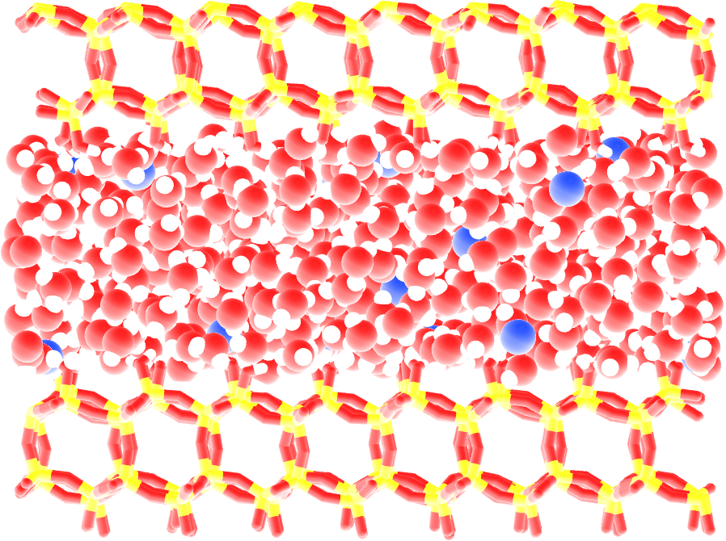
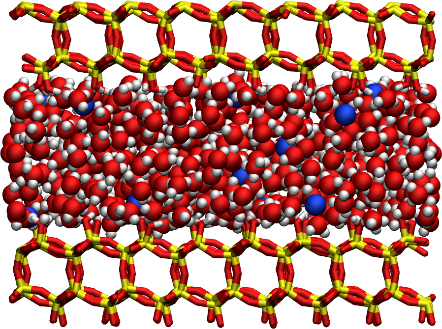
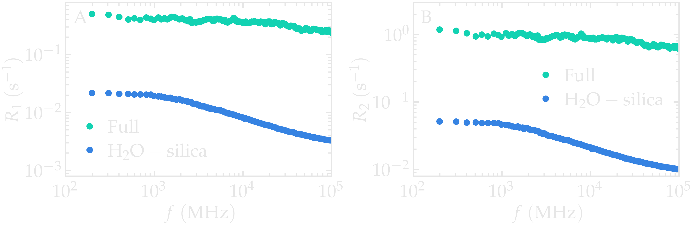
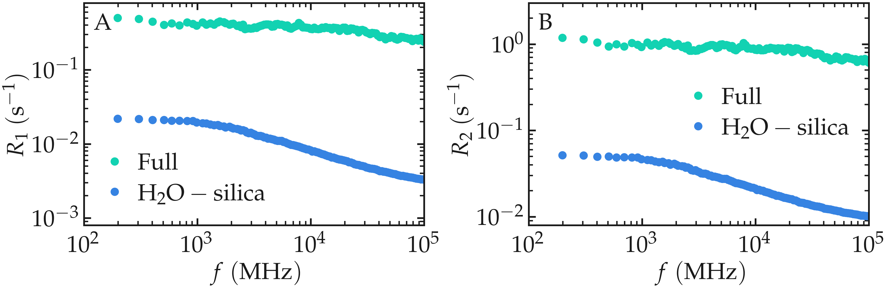

.. include:: ../additional/links.rst
.. _anisotropic-label:

Anisotropic systems
===================

In this tutorial, the :math:`^1\text{H}` relaxation rates, :math:`R_1` and 
:math:`R_2`, are measured for water confined within a nanoslit composed of 
silica. This system represents an anisotropic case in which all three 
correlation functions—:math:`G^{(1)}`, :math:`G^{(2)}`, and :math:`G^{(3)}`—
must be evaluated, and the rates are calculated using Eq. :eq:`eq_BPP`. The 
hydrogen atoms of interest include those in the water molecules as well as 
those in the surface hydroxyl (-OH) groups of the silica. The individual 
contributions to :math:`R_1` and :math:`R_2`—namely, intra-molecular, 
inter-molecular, and water-hydroxyl interactions—are computed separately.

.. admonition:: Note
    :class: non-title-info

    If you are new to NMRDfromMD, it is recommended to begin with the simpler
    tutorial on :ref:`isotropic-label`.

MD system
---------

The system consists of 594 :math:`\text{TIP4P}-\epsilon` water molecules confined 
within a silica slit nanopore. The surfaces of the slit pores were constructed 
from a :math:`\mathrm{Q}^3` silica material characterized by a surface group 
density of :math:`5~\text{nm}^{-2}` :cite:`gravelle`. Dangling Si atoms were 
functionalized with polar (-OH) groups. The distance between the two walls of the 
slit pore was approximately 1 nm, while the system dimensions along the :math:`x` 
and :math:`y` axes were approximately 4 nm. To balance the surface charge, 8 
sodium ions were added to the slit.  
The trajectory was recorded during a :math:`10\,\text{ns}` production run performed 
using the open-source GROMACS software, in the anisotropic :math:`NP_zT` ensemble, 
with a timestep of :math:`1\,\text{fs}`. The system was maintained at a temperature 
of :math:`T = 300\,\text{K}` and a pressure of :math:`p = 1\,\text{bar}`. Atomic 
positions were saved to the **prod.xtc** file every :math:`2\,\text{ps}`.

.. admonition:: Note
    :class: non-title-info

    If you are interested in learning GROMACS and generating your own
    trajectories, beginner |gromacs-tutorials| are available here.

File Preparation
----------------

To access the GROMACS input files and pre-computed trajectory data, download 
the |zip-water-in-silica| archive, or clone the |dataset-water-in-silica| 
repository using:

.. code-block:: bash

    git clone https://github.com/NMRDfromMD/dataset-water-in-silica.git

The necessary trajectory files for this tutorial are located in the ``data/`` 
directory.

Create a MDAnalysis universe
----------------------------

Open a new Python script or a new notebook, and define the path to the data 
files:

.. code-block:: python

    datapath = "mypath/water-in-silica/raw-data/N50/"

Then, import NumPy, MDAnalysis, and NMRDfromMD:

.. code-block:: python

    import numpy as np
    import MDAnalysis as mda
    from nmrdfrommd import NMRD

From the trajectory files, create a MDAnalysis universe by loading the 
configuration file and the trajectory:

.. code-block:: python

    u = mda.Universe(
        datapath + "prod.tpr",
        datapath + "prod.xtc")

Launch the :math:`^1\text{H}`-NMR analysis
------------------------------------------

First, we create three atom groups: the hydrogen atoms of the silica, 
``H_SIL``, the hydrogen atoms of the water, ``H_H2O``, and all the hydrogen 
atoms, ``H_ALL``:

.. code-block:: python

    H_SIL = u.select_atoms("resname SiOH and type HOY")
    H_H2O = u.select_atoms("resname SOL and type HW")
    H_ALL = H_H2O + H_SIL

Next, we run ``NMRDfromMD`` for all hydrogen atoms:

.. code-block:: python

    nmr_full= NMRD(
        u=u,
        atom_group=H_ALL,
        isotropic = False,
        type_analysis="full",
        number_i=5)
    nmr_full.run_analysis()

Note the use of ``isotropic=False``, which is required here because the system 
is anisotropic, by opposition to the bulk system from :ref:`isotropic-label`. 
With ``number_i=5``, only 5 randomly selected atoms from ``H_ALL`` are included 
in the calculation. Increasing this number improves statistical resolution, 
while setting ``number_i=0`` includes all atoms in the group.

We can also calculate the :math:`^1\text{H}`-NMR relaxation originating from 
the water-silica interaction only:

.. code-block:: python

    nmr_water_silica = NMRD(
        u=u,
        atom_group=H_H2O,
        neighbor_group = H_SIL,
        isotropic = False,
        type_analysis="full",
        number_i=50)
    nmr_water_silica.run_analysis()

Extract the :math:`^1\text{H}`-NMR spectra
------------------------------------------

Let us access the full :math:`^1\text{H}`-NMR relaxation rates, as well as the 
partial ones:

.. code-block:: python

    R1_full = nmr_full.R1
    R2_full = nmr_full.R2
    f_full = nmr_full.f

    R1_water_silica = nmr_water_silica.R1
    R2_water_silica = nmr_water_silica.R2
    f_water_silica = nmr_water_silica.f

.. container:: figurelegend

    Figure: :math:`^1\text{H}`-NMR relaxation rates :math:`R_1` for water
    confined in a silica slit.

It can be seen that the :math:`\text{H}_2\text{O}-\text{silica}` contribution 
to the total :math:`^1\text{H}`-NMR relaxation is much smaller than the total 
contribution. This indicates that the full :math:`^1\text{H}`-NMR spectra is 
mostly affected by the other contributions that are here the water-water 
interactions.