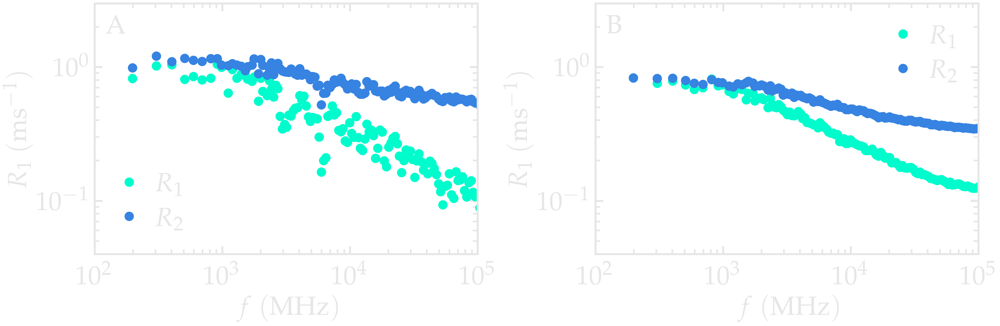
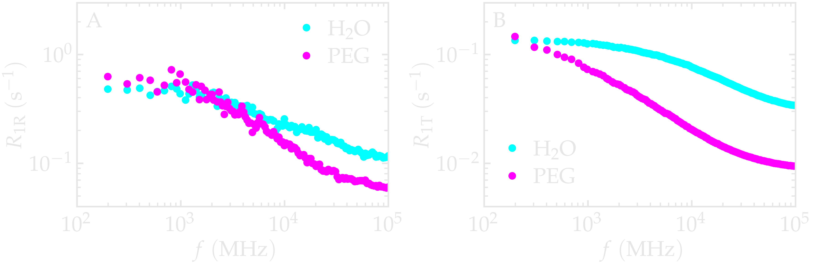
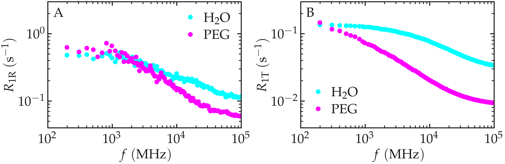

.. include:: ../additional/links.rst
.. _isotropic-label:

Isotropic system
================

Here, we illustrate how the ``NMRDfromMD`` package can be applied to a
simple MD simulation. The NMR relaxation times :math:`T_1` and :math:`T_2`
are measured from a bulk polymer-water mixture using ``NMRDfromMD``.
To follow the tutorial, |MDAnalysis|, |NumPy|, and
|Matplotlib| must be installed.

MD system
---------

.. image:: isotropic-system/snapshot-dark.png
    :class: only-dark
    :alt: PEG-water mixture simulated with LAMMPS - Dipolar NMR relaxation time calculation
    :width: 250
    :align: right

.. image:: isotropic-system/snapshot-light.png
    :class: only-light
    :alt: PEG-water mixture simulated with LAMMPS - Dipolar NMR relaxation time calculation
    :width: 250
    :align: right

The system consists of a bulk mixture of 420 :math:`\text{H}_2\text{O}` water
molecules and 30 :math:`\text{PEG 300}` polymer molecules. The :math:`\text{TIP4P}-\epsilon`
is used for the water :cite:`fuentes-azcatlNonPolarizableForceField2014`.
:math:`\text{PEG 300}` refers to polyethylene glycol chains with a molar mass of
:math:`300~\text{g/mol}`. The trajectory was recorded during a
:math:`10~\text{ns}` production run performed using the open-source code
LAMMPS in the :math:`NpT` ensemble with a timestep of :math:`1~\text{fs}`.
The temperature was set to :math:`T = 300~\text{K}` and the pressure to
:math:`p = 1~\text{atm}`. Atomic positions were saved in the **prod.xtc** file
every :math:`2~\text{ps}`.

.. admonition:: Note
    :class: non-title-info

    If you'd like to learn LAMMPS and generate your own trajectories, beginner
    |lammps-tutorials| are available here :cite:`gravelleSetTutorialsLAMMPS2025`.

File preparation
----------------

To access the LAMMPS input files and pre-computed trajectory
data, download the |zip-peg-water-mixture| archive, or clone the
|dataset-peg-water-mixture| repository using:

.. code-block:: bash

    git clone https://github.com/NMRDfromMD/dataset-peg-water-mixture.git

The necessary trajectory files for this tutorial are located in the ``data/``
directory.

Create a MDAnalysis universe
----------------------------

Open a new Python script or Notebook, and define the path to the data files:

.. code-block:: python

	datapath = "mypath/polymer-in-water/data/"

Then, import ``NumPy``, ``MDAnalysis``, and the ``NMRD``
module of ``NMRDfromMD``:

.. code-block:: python

	import numpy as np
	import MDAnalysis as mda
	from nmrdfrommd import NMRD

From the trajectory files, create a ``universe`` by loading the
configuration file and trajectory:

.. code-block:: python

    u = mda.Universe(datapath+"production.data",
                     datapath+"production.xtc")

.. admonition:: Note
    :class: non-title-info
        
    The MDAnalysis ``universe``, ``u``, contains both the topology
    (atom types, masses, etc.) and the trajectory (atom positions
    at each frame). These informations are used by ``NMRDfromMD``
    for the calculation of NMR properties.

Let us print some basic information from the ``universe``, such as the number
of molecules (water and PEG):

.. code-block:: python

    n_TOT = u.atoms.n_residues
    n_H2O = u.select_atoms("type 6 7").n_residues
    n_PEG = u.select_atoms("type 1 2 3 4 5").n_residues

    print(f"The total number of molecules is {n_TOT} ({n_H2O} H2O, {n_PEG} PEG)")

Executing the script using Python will return:

.. code-block:: bw

    The total number of molecules is 450 (420 H2O, 30 PEG)

Let us also print information concerning the trajectory,
namely the timestep, ``timestep`` and
the total duration of the simulation, ``total_time``:

.. code-block:: python

    timestep = np.int32(u.trajectory.dt)
    total_time = np.int32(u.trajectory.totaltime)

    print(f"The timestep is {timestep} ps")
    print(f"The total simulation time is {total_time//1000} ns")

Executing the script using Python will return:

.. code-block:: bw

    The timestep is 2 ps
    The total simulation time is 10 ns

.. admonition:: Note
    :class: non-title-info

    In the context of ``MDAnalysis``, the ``timestep`` refers to the duration between
    two recorded frames, which is different from the actual timestep of
    :math:`1\,\text{fs}` used in the LAMMPS molecular dynamics simulation.

Launch the H-NMR analysis
-------------------------

Let us create three atom groups: the hydrogen atoms of the PEG, the hydrogen
atoms of the water, and all hydrogen atoms:

.. code-block:: python

    H_PEG = u.select_atoms("type 3 5")
    H_H2O = u.select_atoms("type 7")
    H_ALL = H_PEG + H_H2O

Then, let us first run NMRDfromMD for all hydrogen atoms:

.. code-block:: python

    nmr_all = NMRD(
        u=u,
        atom_group=H_ALL,
        neighbor_group = H_ALL,
        number_i=20)
    nmr_all.run_analysis()

With ``number_i = 20``, only 20 randomly selected atoms from ``H_ALL`` are
used in the calculation. Increase this number for better statistical resolution,
or set ``number_i = 0`` to include all atoms in the group. Here, ``H_ALL``
is specified as both the ``atom_group`` and ``neighbor_group``.

Let us access the calculated value of the NMR relaxation time :math:`T_1`
in :math:`f \to 0` by adding the following lines to the Python script:

.. code-block:: python

    T1 = np.round(nmr_all.T1, 2)

    print(f"The NMR relaxation time is T1 = {T1} s")

which should return:

.. code-block:: bw

    The NMR relaxation time is T1 = 1.59 s

The exact value you obtain will likely be different, as it depends on which hydrogen
atoms were randomly selected for the calculation. With the relatively small value
``number_i = 20``, the uncertainty is important. You can increase that number
for more precise result, but this will increase the computation time.

Extract the NMR spectra
-----------------------

The relaxation rates :math:`R_1 (f) = 1/T_1 (f)` (in units of :math:`\text{s}^{-1}`)
and :math:`R_2 (f) = 1/T_2 (f)` spectra can be extracted for all
frequency :math:`f` (in MHz) as ``nmr_all.R1`` and ``nmr_all.R2``, respectively.
The corresponding frequencies are stored in ``nmr_all.f``.

.. code-block:: python

    R1_spectrum = nmr_all.R1
    R2_spectrum = nmr_all.R2
    f = nmr_all.f

The spectra :math:`R_1 (t)` and :math:`R_2 (f)` can then be plotted as a
function of :math:`f` using ``pyplot``:

.. code-block:: python

    from matplotlib import pyplot as plt

    # Plot settings
    plt.figure(figsize=(8, 5))
    plt.loglog(f, R1_spectrum, 'o', label='R1', markersize=5)
    plt.loglog(f, R2_spectrum, 's', label='R2', markersize=5)
    # Labels and Title
    plt.xlabel("Frequency (MHz)", fontsize=12)
    plt.ylabel("Relaxation Rates (s⁻¹)", fontsize=12)
    # Grid and boundaries
    plt.grid(True, which="both", linestyle='--', linewidth=0.7)
    plt.xlim(80, 1e5)
    plt.ylim(0.05, 2)
    # Legend
    plt.legend()
    plt.tight_layout()
    plt.show()

.. image:: isotropic-system/nmr-total.png
    :class: only-light
    :alt: NMR results obtained from the LAMMPS simulation of water

.. container:: figurelegend

    Figure: NMR relaxation rates :math:`R_1` (A) and :math:`R_2` (B)
    as a function of the frequency :math:`f` for the
    :math:`\text{PEG-H}_2\text{O}` bulk mixture. Results are provided for
    two different values of ``number_i``, :math:`n_i`.

Separating intra- from inter- contributions.
--------------------------------------------

So far, calculations were done for the two molecules types PEG and H2O,
without separating intra from inter molecular contributions.
Such separation is however meaningfull and allow for identifying
the main contributors to the relaxation.

Let us extract the intramolecular contributions to the relaxation
for both water and PEG, separately:

.. code-block:: python

    nmr_h2o_intra = NMRD(
        u=u,
        atom_group=H_H2O,
        type_analysis="intra_molecular",
        number_i=200)
    nmr_h2o_intra.run_analysis()

    nmr_peg_intra = NMRD(
        u=u,
        atom_group=H_PEG,
        type_analysis="intra_molecular",
        number_i=200)
    nmr_peg_intra.run_analysis()

We can also measure the the intermolecular contributions:

.. code-block:: python

    nmr_h2o_inter = NMRD(
        u=u,
        atom_group=H_H2O,
        type_analysis="inter_molecular",
        number_i=200)
    nmr_h2o_inter.run_analysis()

    nmr_peg_inter = NMRD(
        u=u,
        atom_group=H_PEG,
        type_analysis="inter_molecular",
        number_i=200)
    nmr_peg_inter.run_analysis()

Importandly, when no ``neighbor_group`` group is specified, ``atom_group``
is used for the neighbor group. Therefore, here, the intermolecar contributions
are calculated between molecules of the same type only.

If we compare the NMR spectra, ``nmr_h2o_inter.R1`` and ``nmr_h2o_intra.R1``,
it can be seen that the intramolecular contributions to R1 are larger than the
intramolecular contributions in this case. The intramolecular and intramolecular spectra
also show different scalling with the frequency, :math:`f`, due to the contribution to these
terms. Roughly speaking, the intramolecular contribution :math:`R_{1 \text{R}}` is mainly
linked to the rotational motion of the molecules, and :math:`R_{1 \text{T}}` to their
translational motions.

.. container:: figurelegend

    Figure: Intramolecular NMR relaxation rates :math:`R_{1 \text{R}}` (A) and
    Intermolecular NMR relaxation rates :math:`R_{1 \text{T}}` (B)
    as a function of the frequency :math:`f` for the
    :math:`\text{PEG-H}_2\text{O}` bulk mixture. Results are provided for
    :math:`n_i = 1280`.

The correlation functions can also be extracted from NMRDfromMD.